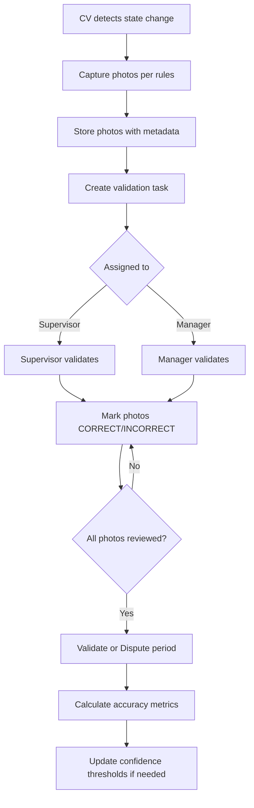
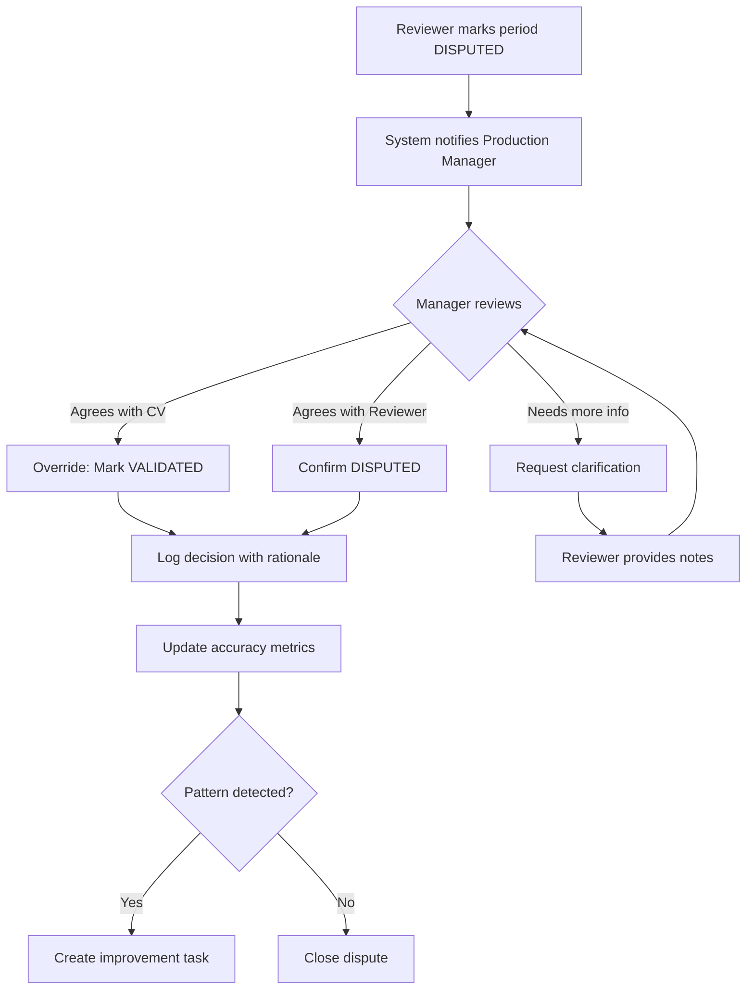

# CV-VALIDATION: Accuracy & Testing Specification

**Module:** CV-VALIDATION  
**Version:** 1.0  
**Date:** 2026-01-10  
**Author:** Adityajain (via BMad Master)  
**Status:** Draft — Planning Phase

---

## Executive Summary

This specification defines the validation methodology for the AIS Production CV system. Validation ensures the CV system's state detections (RUNNING vs BREAK) accurately reflect actual production activity before the system becomes a trusted data source.

### Validation Philosophy

> **Trust is earned, not assumed.**
> 
> The CV system must prove its accuracy through human validation before becoming the authoritative source for production runtime data. This is a phased approach:
> - **Phase 1 (MVP-Plus):** Manual photo validation — supervisors/managers confirm CV detections
> - **Phase 2 (Future):** Automated cross-validation against Hydra production weights

---

## 1. Validation Approach Overview

### 1.1 Two-Phase Validation Strategy

```
┌─────────────────────────────────────────────────────────────────────────┐
│                    VALIDATION EVOLUTION                                  │
├─────────────────────────────────────────────────────────────────────────┤
│                                                                         │
│   PHASE 1: PHOTO SAMPLING (MVP-Plus)                                   │
│   ┌─────────────────────────────────────────────────────────────┐      │
│   │  • 5-7 photos per production period (run/break)             │      │
│   │  • Supervisor/Manager reviews photos in AIS dashboard       │      │
│   │  • Human confirms: "Was mill actually RUNNING/BREAK?"       │      │
│   │  • Target: ≥95% agreement before CV becomes trusted         │      │
│   │  • Duration: First 2-4 weeks of CV deployment               │      │
│   └─────────────────────────────────────────────────────────────┘      │
│                              │                                          │
│                              ▼                                          │
│   PHASE 2: HYDRA CROSS-VALIDATION (Future)                             │
│   ┌─────────────────────────────────────────────────────────────┐      │
│   │  • CV runtime produces expected throughput                  │      │
│   │  • Hydra weights from next-day reconciliation               │      │
│   │  • If CV says 6h running, Hydra should show ~X tons        │      │
│   │  • Automated variance detection                             │      │
│   │  • Reduces manual validation burden                         │      │
│   └─────────────────────────────────────────────────────────────┘      │
│                                                                         │
└─────────────────────────────────────────────────────────────────────────┘
```

### 1.2 Why Not Electric Meter?

Per PRD update, electric meter correlation was removed as ground truth because:
- Electric consumption varies with product size, furnace settings, ambient temperature
- Correlation is loose — not tight enough for validation
- Hydra weights provide a cleaner production output measure

---

## 2. Phase 1: Photo Sampling Validation

### 2.1 Photo Capture Strategy

**Goal:** Capture sufficient visual evidence for humans to verify CV state detections.

```yaml
photo_capture_rules:
  # Capture at state transitions
  state_change:
    enabled: true
    photos_per_transition: 3
    timing_seconds: [0, 5, 10]  # At transition, +5s, +10s
    cameras: [CAM-1, CAM-2]     # Primary and secondary
    
  # Capture periodically during states
  periodic:
    running:
      interval_seconds: 300     # Every 5 minutes
      min_photos_per_period: 5
      max_photos_per_period: 10
    break:
      interval_seconds: 180     # Every 3 minutes
      min_photos_per_period: 5
      max_photos_per_period: 10
      
  # Extra capture on confidence fluctuation
  confidence_drop:
    trigger: confidence drops > 15% within 30 seconds
    photos: 2
    cameras: all
    
  # End of period capture
  period_end:
    enabled: true
    photos: 2
    timing_seconds: [-10, 0]  # 10s before and at transition
```

### 2.2 Photo Selection for Validation

Not all captured photos need validation — system selects a representative sample:

```yaml
photo_selection:
  strategy: stratified_sampling
  
  rules:
    - source: state_transitions
      include: all          # Always include transition photos
      
    - source: periodic
      include: distributed  # Spread across period duration
      count: 3-5 per period
      
    - source: confidence_drop
      include: all          # Always include anomaly photos
      
  selection_criteria:
    - Spread evenly across period timeline
    - Include lowest confidence photos
    - Include photos from different cameras
    - Target: 5-7 photos per period
    
  exclusions:
    - Duplicate or near-duplicate frames (similarity > 95%)
    - Photos with camera feed errors (black frames, frozen frames)
```

### 2.3 Validation UI

**Photo Review Interface:**

```
┌─────────────────────────────────────────────────────────────────────────┐
│ 🔍 CV VALIDATION                                     Shift 2 — Jan 9    │
├─────────────────────────────────────────────────────────────────────────┤
│                                                                         │
│ PERIOD: RUNNING                                                         │
│ Time: 14:32:15 — 15:05:00 (32 min 45 sec)                              │
│ CV Confidence: 91% avg                                                  │
│                                                                         │
│ ┌─────────────────────────────────────────────────────────────────────┐ │
│ │                                                                     │ │
│ │                    [ PHOTO VIEWER ]                                 │ │
│ │                                                                     │ │
│ │         ┌─────────────────────────────────────────┐                │ │
│ │         │                                         │                │ │
│ │         │         Current Photo (3/7)             │                │ │
│ │         │                                         │                │ │
│ │         │    CAM-1 — 14:42:15 — 92% confidence   │                │ │
│ │         │                                         │                │ │
│ │         │    [Detected: RUNNING]                  │                │ │
│ │         │                                         │                │ │
│ │         └─────────────────────────────────────────┘                │ │
│ │                                                                     │ │
│ │   [◀ Previous]  Photo 3 of 7  [Next ▶]                            │ │
│ │                                                                     │ │
│ └─────────────────────────────────────────────────────────────────────┘ │
│                                                                         │
│ ┌─────────────────────────────────────────────────────────────────────┐ │
│ │ Photo Thumbnails:                                                   │ │
│ │                                                                     │ │
│ │  [✓]      [✓]      [●]      [ ]      [ ]      [ ]      [ ]        │ │
│ │  14:32    14:37    14:42    14:47    14:52    14:57    15:02       │ │
│ │                                                                     │ │
│ │  ✓ = Marked correct    ● = Current    ✗ = Marked incorrect        │ │
│ └─────────────────────────────────────────────────────────────────────┘ │
│                                                                         │
│ FOR THIS PHOTO — Was the mill actually RUNNING?                        │
│                                                                         │
│ ┌─────────────────────────────────────────────────────────────────────┐ │
│ │                                                                     │ │
│ │   [✓ YES — Correct Detection]    [✗ NO — Incorrect Detection]     │ │
│ │                                                                     │ │
│ │   [⚠️ UNCLEAR — Cannot Determine]                                   │ │
│ │                                                                     │ │
│ └─────────────────────────────────────────────────────────────────────┘ │
│                                                                         │
│ ─────────────────────────────────────────────────────────────────────── │
│                                                                         │
│ PERIOD SUMMARY (after all photos reviewed):                            │
│                                                                         │
│ [✓ VALIDATE PERIOD — Detection was accurate]                          │
│ [✗ DISPUTE PERIOD — Detection was inaccurate]                         │
│                                                                         │
│ Progress: 4/7 periods validated today                                  │
└─────────────────────────────────────────────────────────────────────────┘
```

### 2.4 Validation Workflow



### 2.5 Validation Responsibilities

| Role | Validation Scope | Frequency |
|------|------------------|-----------|
| **Supervisor** | Own shift periods | End of each shift |
| **Production Manager** | All shifts (spot check) | Daily review |
| **Owner** | Disputed periods only | As needed |

**Validation Assignment Logic:**

```yaml
validation_assignment:
  primary: shift_supervisor
  fallback: production_manager
  escalation:
    - if: photo marked INCORRECT or UNCLEAR
      then: escalate to production_manager
    - if: period_disputed
      then: notify owner
      
  deadlines:
    supervisor_review: 4 hours after shift end
    manager_review: 24 hours after shift end
    auto_close: 72 hours (if no disputes, mark VALIDATED)
```

### 2.6 Validation Outcomes

| Outcome | Definition | Action |
|---------|------------|--------|
| **VALIDATED** | ≥80% of photos marked CORRECT | Period confirmed, data trusted |
| **DISPUTED** | <80% photos CORRECT, or reviewer explicitly disputes | Flag for investigation |
| **INCONCLUSIVE** | Too many UNCLEAR marks | Request re-review with notes |
| **EXPIRED** | Not reviewed within 72 hours | Auto-mark VALIDATED if confidence >85% |

---

## 3. Accuracy Measurement

### 3.1 Accuracy Metrics

```typescript
interface CVAccuracyMetrics {
  // Per-shift metrics
  shift_accuracy: {
    total_periods: number;
    validated_correct: number;
    validated_incorrect: number;
    disputed: number;
    pending: number;
    accuracy_percent: number;  // validated_correct / (correct + incorrect)
  };
  
  // Rolling metrics
  rolling_7_day: {
    total_periods: number;
    accuracy_percent: number;
    trend: 'improving' | 'stable' | 'declining';
  };
  
  // Per-camera metrics
  camera_accuracy: {
    [camera_id: string]: {
      agreement_rate: number;  // % of photos marked correct
      false_positive_rate: number;  // Detected RUNNING when actually BREAK
      false_negative_rate: number;  // Detected BREAK when actually RUNNING
    };
  };
  
  // Per-state metrics
  state_accuracy: {
    running_detection_accuracy: number;
    break_detection_accuracy: number;
  };
}
```

### 3.2 Accuracy Calculation

```
ACCURACY FORMULA:

Overall Accuracy = (Correct Validations / Total Validations) × 100%

Where:
- Correct Validations = Photos marked CORRECT
- Total Validations = Photos marked CORRECT + INCORRECT
- UNCLEAR marks are excluded from calculation

Example:
- Shift had 7 periods, each with 6 validated photos
- Total photos: 42
- Marked CORRECT: 40
- Marked INCORRECT: 1
- Marked UNCLEAR: 1

Accuracy = 40 / (40 + 1) = 97.6%
```

### 3.3 Accuracy Dashboard

```
┌─────────────────────────────────────────────────────────────────────────┐
│ 📊 CV ACCURACY DASHBOARD                                                │
├─────────────────────────────────────────────────────────────────────────┤
│                                                                         │
│ CURRENT ACCURACY: 96.2%                         Target: ≥95%  ✓        │
│ ████████████████████████████████████████░░░                             │
│                                                                         │
│ ┌─────────────────────────────────────────────────────────────────────┐ │
│ │ 7-DAY TREND                                                         │ │
│ │                                                                     │ │
│ │  100% ┤                                                             │ │
│ │   95% ┤──────────────────────────────────────────                  │ │
│ │   90% ┤     ●───●───●───●───●───●───●                              │ │
│ │   85% ┤                                                             │ │
│ │       └────┬───┬───┬───┬───┬───┬───┬                               │ │
│ │           Jan4 Jan5 Jan6 Jan7 Jan8 Jan9 Jan10                       │ │
│ │                                                                     │ │
│ └─────────────────────────────────────────────────────────────────────┘ │
│                                                                         │
│ BY CAMERA:                                                              │
│ ├─ CAM-1 (Furnace):   97.8%  ████████████████████░                     │
│ ├─ CAM-2 (Stands):    95.4%  ████████████████████░                     │
│ └─ CAM-3 (Cooling):   93.1%  ███████████████████░░                     │
│                                                                         │
│ BY STATE:                                                               │
│ ├─ RUNNING detection: 97.2%  ████████████████████░                     │
│ └─ BREAK detection:   94.8%  ████████████████████░                     │
│                                                                         │
│ RECENT ISSUES:                                                          │
│ ├─ Jan 9, 18:42 — False BREAK detected (CAM-1 steam obstruction)      │
│ └─ Jan 8, 07:15 — Delayed RUNNING detection (slow furnace pull)        │
│                                                                         │
│ [View All Validations]  [Export Report]  [Adjust Thresholds]           │
└─────────────────────────────────────────────────────────────────────────┘
```

### 3.4 Success Criteria

| Metric | Target | Gate for Trust |
|--------|--------|----------------|
| **Overall Accuracy** | ≥95% | Required before CV becomes authoritative |
| **RUNNING Detection** | ≥97% | Critical — don't miss production time |
| **BREAK Detection** | ≥93% | Important — don't over-count runtime |
| **False Positive Rate** | <3% | Incorrect RUNNING detections |
| **False Negative Rate** | <2% | Missed RUNNING detections |
| **Validation Completion** | ≥90% | Shifts validated within 24 hours |

---

## 4. Phase 2: Hydra Cross-Validation (Future)

### 4.1 Concept

Once Phase 1 demonstrates high accuracy, Phase 2 adds automated cross-validation:

```
CROSS-VALIDATION LOGIC:

CV Runtime (hours) × Expected Throughput (tons/hour) ≈ Hydra Total (tons)

Example:
- CV reports: 6.5 hours of RUNNING time
- Expected throughput: 2 tons/hour (based on product mix)
- Expected production: 6.5 × 2 = 13 tons
- Hydra total: 12.8 tons
- Variance: 1.5% — ACCEPTABLE

If variance > 10%:
- Flag for investigation
- Either CV detection was wrong, OR
- Throughput estimate was wrong
```

### 4.2 Throughput Estimation

```yaml
throughput_model:
  # Throughput varies by product being produced
  base_rates:
    - product_type: "A 30/12 (18ft)"
      tons_per_hour: 2.2
    - product_type: "A 24/2"
      tons_per_hour: 1.8
    - product_type: "Mixed sizes"
      tons_per_hour: 1.9  # Average
      
  adjustments:
    - factor: furnace_temperature
      impact: ±5%
    - factor: crew_experience
      impact: ±10%
    - factor: material_quality
      impact: ±8%
      
  confidence:
    initial: 70%  # Model needs calibration
    target: 85%   # After 30 days of data
```

### 4.3 Cross-Validation Report

```
┌─────────────────────────────────────────────────────────────────────────┐
│ 📊 CV-HYDRA CROSS-VALIDATION — Shift 2, Jan 9                          │
├─────────────────────────────────────────────────────────────────────────┤
│                                                                         │
│ CV RUNTIME: 6h 48m (6.8 hours)                                         │
│ PRODUCT: A 30/12 (18ft) — Expected: 2.2 tons/hour                      │
│                                                                         │
│ EXPECTED PRODUCTION: 6.8 × 2.2 = 14.96 tons                            │
│ HYDRA ACTUAL:        14.42 tons                                        │
│ VARIANCE:            -3.6%  ✓ ACCEPTABLE                               │
│                                                                         │
│ ┌─────────────────────────────────────────────────────────────────────┐ │
│ │ TIMELINE COMPARISON                                                 │ │
│ │                                                                     │ │
│ │ CV STATE:    ████████░░░████████████████████░░████████████         │ │
│ │              RUN      BRK    RUN                 BRK   RUN          │ │
│ │                                                                     │ │
│ │ HYDRA PICKS: ▪▪▪▪▪▪▪▪   ▪▪▪▪▪▪▪▪▪▪▪▪▪▪▪▪▪▪▪   ▪▪▪▪▪▪▪▪▪           │ │
│ │              (clusters align with CV RUNNING periods)               │ │
│ │                                                                     │ │
│ └─────────────────────────────────────────────────────────────────────┘ │
│                                                                         │
│ CONFIDENCE: HIGH — Pick clusters match CV periods                      │
│                                                                         │
│ [Accept]  [Investigate Variance]                                       │
└─────────────────────────────────────────────────────────────────────────┘
```

### 4.4 Phase 2 Implementation Notes

- Requires 30+ days of Phase 1 data to calibrate throughput model
- Product mix tracking needed from production planning
- Variance thresholds will be tuned based on actual data
- Not a replacement for Phase 1 — complementary validation

---

## 5. Testing Strategy

### 5.1 Pre-Deployment Testing

**Controlled Environment Testing:**

```yaml
controlled_testing:
  duration: 3-5 days before production deployment
  
  scenarios:
    - name: "Continuous Running"
      duration_hours: 2
      expected_state: RUNNING throughout
      validation: Human observer confirms
      
    - name: "Extended Break"
      duration_hours: 1
      expected_state: BREAK throughout
      validation: Human observer confirms
      
    - name: "Rapid State Changes"
      description: Start/stop every 5-10 minutes
      expected: Accurate state tracking with debouncing
      
    - name: "Camera Obstruction"
      description: Temporarily block each camera
      expected: Graceful degradation, appropriate confidence drop
      
    - name: "Night Operation"
      description: Low ambient light
      expected: Detection still accurate (glow more visible)
      
    - name: "Steam/Smoke"
      description: Heavy steam from furnace
      expected: Temporary confidence drop, recovery
      
  success_criteria:
    - All scenarios pass
    - Zero false positives in BREAK test
    - Zero false negatives in RUNNING test
    - Correct graceful degradation behavior
```

### 5.2 Calibration Process

```
CALIBRATION PROCEDURE:

1. BASELINE CAPTURE (Day 1-2)
   - Record 10+ hours of production
   - Human observer logs actual state changes manually
   - CV runs in "shadow mode" (detect but don't report)
   
2. THRESHOLD TUNING (Day 2-3)
   - Compare CV detections to human observations
   - Adjust per-camera thresholds:
     • Luminosity threshold
     • Motion threshold
     • Min area pixels
     • Break timeout duration
   - Re-run shadow mode to verify
   
3. ROI REFINEMENT (Day 3-4)
   - Review detection zones
   - Adjust ROI boundaries if false positives at edges
   - Document final ROI settings with reference images
   
4. CONFIDENCE CALIBRATION (Day 4-5)
   - Verify confidence scores align with actual certainty
   - Tune confidence thresholds:
     • High confidence: ≥85% (immediate state change)
     • Low confidence: <50% (UNKNOWN state)
   - Test edge cases
   
5. SIGN-OFF
   - Production Manager reviews calibration results
   - Approval to go live
   - Document baseline accuracy
```

### 5.3 Go-Live Checklist

```markdown
## CV System Go-Live Checklist

### Hardware Verification
- [ ] CAM-1 (Furnace): Feed stable, ROI calibrated
- [ ] CAM-2 (Stands): Feed stable, ROI calibrated  
- [ ] CAM-3 (Cooling): Feed stable, ROI calibrated
- [ ] NVR: Recording correctly, RTSP accessible
- [ ] Raspberry Pi: Processing all 3 streams, <70% CPU
- [ ] Network: Stable connectivity to AIS server

### Software Verification
- [ ] Detection logic: Correct state transitions
- [ ] Photo capture: Sampling per specification
- [ ] API integration: Events reaching server
- [ ] Dashboard: Real-time updates working
- [ ] Validation UI: Photos accessible, workflow working

### Calibration Verification
- [ ] Baseline accuracy: ≥90% in controlled testing
- [ ] Thresholds documented
- [ ] ROI settings documented with reference images
- [ ] Edge cases tested and handled

### Operational Readiness
- [ ] Supervisors trained on validation workflow
- [ ] Production Manager briefed on accuracy dashboard
- [ ] Alert recipients configured
- [ ] Offline recovery tested
- [ ] Rollback procedure documented

### Sign-Off
- [ ] Production Manager approval: _______________
- [ ] Go-live date: _______________
- [ ] First validation review scheduled: _______________
```

---

## 6. Continuous Improvement

### 6.1 Feedback Loop

```
VALIDATION → ANALYSIS → ADJUSTMENT → VALIDATION

1. COLLECT: Validation results from reviewers
2. ANALYZE: Identify patterns in incorrect detections
   - Which camera?
   - What time of day?
   - What was the actual situation?
3. ADJUST: Tune thresholds or ROI based on patterns
4. VALIDATE: Confirm improvement in next validation cycle
5. DOCUMENT: Record all adjustments with rationale
```

### 6.2 Threshold Adjustment Workflow

```yaml
threshold_adjustment:
  trigger:
    - accuracy drops below 93% for 3+ consecutive days
    - specific camera accuracy drops below 90%
    - repeated false positives/negatives in same scenario
    
  process:
    1. System flags potential issue
    2. Production Manager reviews flagged detections
    3. If pattern identified, propose threshold change
    4. Test in shadow mode for 24 hours
    5. If improved, apply permanently
    6. Document change in configuration history
    
  approval:
    minor_adjustment: Production Manager
    major_adjustment: Owner + Production Manager
    
  documentation:
    - Before/after threshold values
    - Rationale for change
    - Expected impact
    - Actual impact after 7 days
```

### 6.3 Monthly Accuracy Review

```
┌─────────────────────────────────────────────────────────────────────────┐
│ 📊 MONTHLY CV ACCURACY REVIEW — January 2026                           │
├─────────────────────────────────────────────────────────────────────────┤
│                                                                         │
│ SUMMARY:                                                                │
│ ├─ Overall Accuracy:      96.4% (Target: ≥95%) ✓                       │
│ ├─ Periods Validated:     186 of 192 (97%)                             │
│ ├─ Disputes:              2 (1%)                                        │
│ └─ Threshold Adjustments: 1                                             │
│                                                                         │
│ TREND:                                                                  │
│ ├─ Week 1: 94.2%                                                        │
│ ├─ Week 2: 95.8%                                                        │
│ ├─ Week 3: 97.1%                                                        │
│ └─ Week 4: 97.5%  ↑ Improving                                          │
│                                                                         │
│ ISSUES IDENTIFIED:                                                      │
│ ├─ Steam obstruction (3 incidents) — Added 15s debounce                │
│ └─ Slow furnace pull (2 incidents) — Reduced min detection time        │
│                                                                         │
│ RECOMMENDATIONS:                                                        │
│ ├─ Continue photo validation for 1 more month                          │
│ ├─ Begin Phase 2 Hydra cross-validation pilot                          │
│ └─ No threshold changes recommended                                    │
│                                                                         │
│ NEXT REVIEW: February 10, 2026                                         │
└─────────────────────────────────────────────────────────────────────────┘
```

---

## 7. Dispute Resolution

### 7.1 Dispute Types

| Type | Description | Resolution Path |
|------|-------------|-----------------|
| **Detection Dispute** | Reviewer disagrees with CV state | Review raw video if available |
| **Photo Quality Dispute** | Cannot determine from photo | Capture better photos next time |
| **Boundary Dispute** | State change timing is off | Accept ±30 second tolerance |
| **System Dispute** | CV was offline or malfunctioning | Mark period INCONCLUSIVE |

### 7.2 Dispute Workflow



### 7.3 Dispute Resolution UI

```
┌─────────────────────────────────────────────────────────────────────────┐
│ ⚠️ DISPUTED PERIOD — Resolution Required                                │
├─────────────────────────────────────────────────────────────────────────┤
│                                                                         │
│ Shift: 2 — Jan 9, 2026                                                 │
│ Period: 18:42:00 — 18:55:00 (13 min)                                   │
│ CV Detection: BREAK                                                     │
│ Confidence: 78%                                                         │
│                                                                         │
│ DISPUTED BY: Ramesh (Supervisor)                                        │
│ REASON: "Mill was running — steam from furnace blocked camera"         │
│                                                                         │
│ PHOTOS:                                                                 │
│ ┌─────────────────────────────────────────────────────────────────────┐ │
│ │  [Photo 1]    [Photo 2]    [Photo 3]    [Photo 4]                  │ │
│ │  18:42 ✗     18:45 ✗     18:48 ✗     18:52 ✗                      │ │
│ │  All marked INCORRECT by reviewer                                   │ │
│ └─────────────────────────────────────────────────────────────────────┘ │
│                                                                         │
│ RESOLUTION OPTIONS:                                                     │
│                                                                         │
│ ┌─────────────────────────────────────────────────────────────────────┐ │
│ │ ○ AGREE WITH REVIEWER — CV was wrong (mill was actually RUNNING)   │ │
│ │   Impact: Period reclassified, accuracy metric adjusted            │ │
│ │                                                                     │ │
│ │ ○ AGREE WITH CV — Detection was correct (mill was actually BREAK)  │ │
│ │   Impact: Period validated, reviewer informed                      │ │
│ │                                                                     │ │
│ │ ○ INCONCLUSIVE — Cannot determine actual state                     │ │
│ │   Impact: Period excluded from accuracy calculation                │ │
│ └─────────────────────────────────────────────────────────────────────┘ │
│                                                                         │
│ Manager Notes:                                                          │
│ ┌─────────────────────────────────────────────────────────────────────┐ │
│ │ [                                                                 ] │ │
│ └─────────────────────────────────────────────────────────────────────┘ │
│                                                                         │
│ [Cancel]                                            [Submit Resolution] │
└─────────────────────────────────────────────────────────────────────────┘
```

---

## 8. Audit Trail

### 8.1 What's Logged

```yaml
audit_logging:
  events:
    - photo_captured
    - photo_validated (with result, by whom)
    - period_validated (with outcome, by whom)
    - period_disputed (with reason, by whom)
    - dispute_resolved (with decision, by whom, notes)
    - threshold_changed (before, after, by whom, rationale)
    - accuracy_calculated (daily summary)
    
  retention:
    validation_records: 2 years
    photos: 90 days (thumbnails), 30 days (full resolution)
    audit_logs: 2 years
    accuracy_metrics: Permanent
```

### 8.2 Audit Report

```typescript
interface CVAuditReport {
  period: {
    start_date: Date;
    end_date: Date;
  };
  
  summary: {
    total_periods: number;
    validated: number;
    disputed: number;
    average_accuracy: number;
  };
  
  validations: Array<{
    period_id: string;
    shift_id: string;
    date: Date;
    cv_state: ProductionState;
    cv_confidence: number;
    photo_count: number;
    validation_outcome: 'VALIDATED' | 'DISPUTED' | 'INCONCLUSIVE';
    validated_by: string;
    validated_at: Date;
    notes?: string;
  }>;
  
  threshold_changes: Array<{
    date: Date;
    parameter: string;
    old_value: any;
    new_value: any;
    changed_by: string;
    rationale: string;
  }>;
  
  disputes: Array<{
    period_id: string;
    raised_by: string;
    reason: string;
    resolution: string;
    resolved_by: string;
    resolved_at: Date;
  }>;
}
```

---

## 9. Training Requirements

### 9.1 Supervisor Training

```markdown
## CV Validation Training — Supervisor

### Duration: 30 minutes

### Topics:
1. **What is CV validation?**
   - Why we validate CV detections
   - Your role in ensuring accuracy
   
2. **Using the Validation UI**
   - Accessing pending validations
   - Reviewing photos
   - Marking CORRECT / INCORRECT / UNCLEAR
   - Validating or disputing periods
   
3. **What to look for in photos**
   - RUNNING: Glowing hot stock visible, movement evident
   - BREAK: No glowing material, static scene
   - When you're unsure: Mark UNCLEAR
   
4. **Handling disputes**
   - When to dispute a period
   - Adding notes with context
   - What happens after dispute
   
5. **Practice session**
   - Review 5 sample periods with trainer
   
### Success criteria:
- Complete validation of 3 periods independently
- Accuracy of validation matches trainer's assessment
```

### 9.2 Production Manager Training

```markdown
## CV Validation Training — Production Manager

### Duration: 45 minutes

### Topics:
1. **CV System Overview**
   - How detection works
   - Camera roles (CAM-1 primary, CAM-2 secondary, CAM-3 tertiary)
   - Confidence scoring
   
2. **Accuracy Monitoring**
   - Reading the accuracy dashboard
   - Understanding trends
   - When to investigate
   
3. **Dispute Resolution**
   - Reviewing disputed periods
   - Making resolution decisions
   - Recording rationale
   
4. **Threshold Adjustments**
   - When adjustments are needed
   - How to propose changes
   - Testing and approval process
   
5. **Monthly Review Process**
   - Preparing for reviews
   - Interpreting accuracy reports
   - Continuous improvement actions
   
### Success criteria:
- Resolve 2 sample disputes correctly
- Interpret accuracy dashboard accurately
- Explain threshold adjustment process
```

---

## 10. Dependencies

| Dependency | Module | Required For |
|------------|--------|--------------|
| CV-CORE | Detection Logic | Photos to validate |
| CV-CAMERAS | Camera Config | Understanding camera roles |
| CV-INTEGRATION | ERP Connection | Photo storage, validation APIs |
| AIS Web App | Dashboard | Validation UI |
| Shift Management | AIS Core | Shift context for validation |

---

## 11. Success Criteria

| Metric | Target | Measurement |
|--------|--------|-------------|
| **Photo Coverage** | 5-7 photos per period | Automated capture verification |
| **Validation Completion** | ≥90% within 24 hours | Validation timestamp tracking |
| **Accuracy Achievement** | ≥95% overall | Validation outcome calculation |
| **Dispute Resolution** | <48 hours | Dispute timestamp tracking |
| **Reviewer Training** | 100% supervisors trained | Training completion records |
| **Trust Milestone** | CV becomes authoritative | Owner sign-off after 30 days at ≥95% |

---

## 12. Timeline

```
CV VALIDATION TIMELINE:

WEEK 1-2: Pre-Deployment
├── Hardware installation
├── Initial calibration
├── Controlled testing
└── Supervisor training

WEEK 3: Go-Live
├── CV system activated
├── Photo capture begins
├── Validation workflow active
└── Daily accuracy monitoring

WEEK 4-6: Intensive Validation
├── Full validation on all shifts
├── Threshold tuning as needed
├── Dispute resolution process active
└── Weekly accuracy reviews

WEEK 7-8: Stabilization
├── Reduce validation frequency (spot checks)
├── Confirm sustained ≥95% accuracy
├── Prepare Phase 2 pilot
└── Monthly review

WEEK 9+: Trusted Operation
├── CV becomes authoritative data source
├── Validation becomes spot-check only
├── Phase 2 Hydra cross-validation pilot
└── Continuous improvement loop
```

---

*This specification is part of the AIS Production CV module suite.*
*Related specs: CV-CORE, CV-CAMERAS, CV-INTEGRATION*
