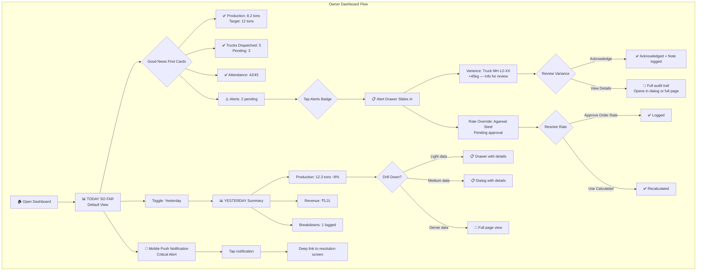
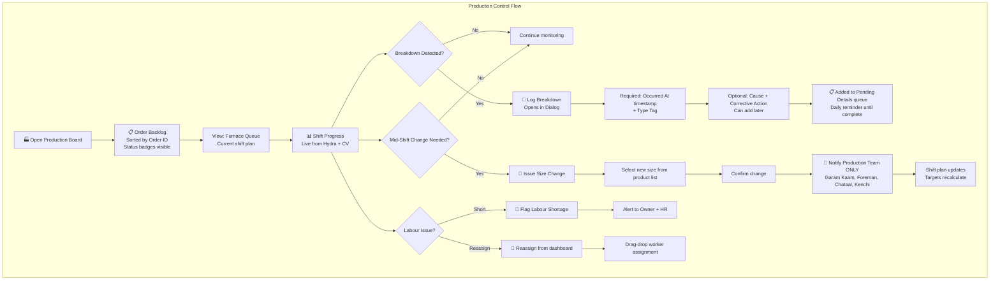
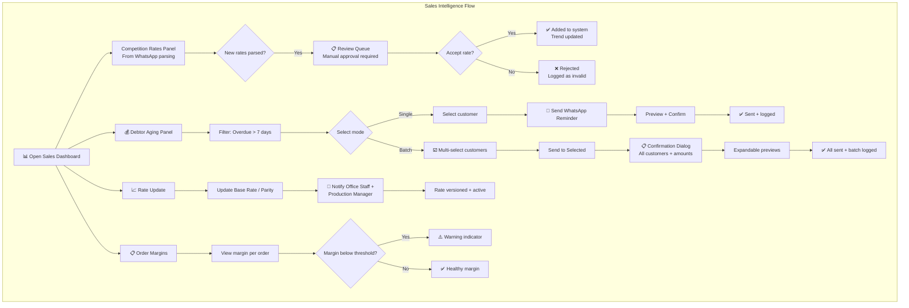
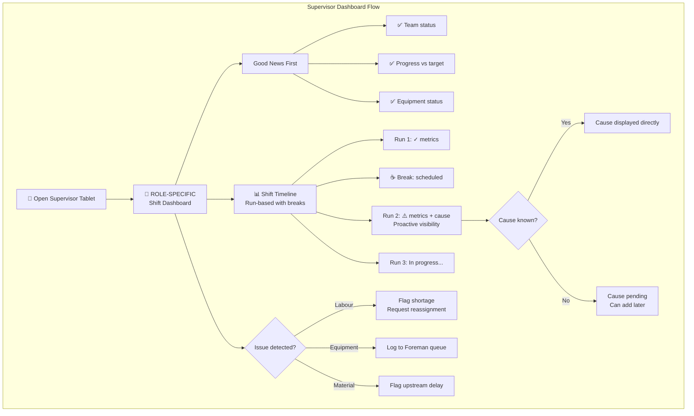
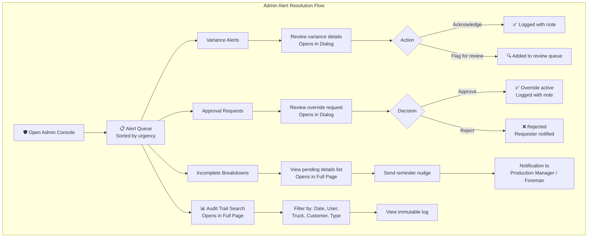

# UX Design Specification — AIS

**Author:** Adityajain
**Date:** 2025-12-27

---

## Executive Summary

### Project Vision

AIS transforms rolling mill operations from gut-feel chaos to data-driven clarity. The core promise: **"Transparency about business at all times."**

The emotional transformation:
- **For the Owner:** From 2 hours of data hunting → 2-minute morning glance with full visibility
- **For Workers:** From blame games → fair recognition backed by objective data ("Data defends me, not surveils me")
- **For the Business:** From firefighting → strategic decision-making

**Critical Insight (Party Mode):** Worker adoption is the foundation of owner trust. If workers don't enter data reliably and in real-time, the owner's dashboard is garbage-in-garbage-out. The UX must make workers feel *protected* by data, not *watched* by it.

### Target Users

**Three-Tier Interface Architecture:**

**Tier 1: Worker Interfaces (Minimal Cognitive Load)**
- Hydra Operator — weight logging, 3 taps max
- Supervisors — shift status, team attendance
- Design principle: One action per screen, glanceable feedback, voice-first consideration

**Tier 2: Operations Interfaces (Workflow-Focused)**
- Office Staff (Prakash) — gate passes, invoices
- Production Manager (Imran) — planning, breakdowns
- Design principle: Devias Kit patterns, clear workflows, moderate complexity

**Tier 3: Strategic Interfaces (Information-Dense)**
- Owner (Adityajain) — executive dashboard, approvals
- Sales & Purchase Head (Rajesh) — pricing, collections, intelligence
- Accountant — ledgers, exports
- Design principle: Analytics depth, trend visualization, decision support

### Key Design Challenges

1. **Worker Delight as Foundation**
   - Worker adoption enables data quality enables owner trust (causal chain)
   - Design for 'data defends me' emotional outcome
   - If workers feel surveilled, they'll resist; if protected, they'll adopt
   - Zero-blame interfaces that explain delays with data, not accusations

2. **Three-Tier Interface Complexity**
   - Worker Tier needs purpose-built industrial UX, not just bigger buttons
   - Consider native mobile for Hydra vs. PWA trade-offs
   - Devias Kit works for Tier 2-3, Tier 1 needs custom patterns

3. **Real-time Entry Path of Least Resistance**
   - If logging takes 3 taps and 5 seconds, workers do it live
   - If it takes 30 seconds, they batch-enter at shift end (data quality suffers)
   - Voice input (Phase 2) may be the killer feature for hands-busy scenarios
   - Design for voice-first, tap-fallback where applicable

4. **Industrial Environment Hostility**
   - 48dp+ touch targets (MUI theme overrides required)
   - High-contrast themes for sunlight readability
   - Offline-first mobile (service worker, IndexedDB, sync queue)
   - Gloves-compatible interaction patterns

5. **Alert Calibration for Trust**
   - False positive overload = users ignore alerts
   - Severity differentiation required (info vs. warning vs. critical)
   - Historical context in alerts ("3rd variance from Truck X this week")
   - Pattern surfacing proactively (FR39c calibration trends)

6. **Offline-First as UX Dependency**
   - Factory floor connectivity is unreliable
   - Requires: Workbox service worker, IndexedDB wrapper, sync queue
   - Conflict resolution UI needed for offline-to-online sync
   - Clear sync status indicators at all times

7. **Variance Resolution Urgency**
   - 15-minute → 30-minute escalation chains
   - Theft flags require immediate attention (negative variance >50kg)
   - Escalation timers visible in UI
   - Resolution workflow must be mobile-friendly (floor decisions)

### Design Opportunities

1. **The "2-Minute Glance" as Trust Proof**
   - Owner dashboard: most information-dense, scannable design possible
   - Success metric: Full operational visibility in under 2 minutes
   - Depends on upstream data quality (worker adoption first)

2. **Gate Pass as First Delight**
   - Currently: 6 rewrites, panic, customer calls
   - Target: First auto-generated gate pass is the "aha moment"
   - Critical path item — dependencies must be prioritized

3. **Zero-Blame Supervisor Interface**
   - Shift timelines that say "Here's why delay happened"
   - Transform culture through UI patterns that defend workers
   - Data as shield, not sword

4. **Voice-First for Hands-Busy** (Phase 2)
   - Hydra Operator with steel in hands can't tap
   - "Log weight 3850 kilos" beats fumbling with screen
   - Design patterns now to enable voice later

5. **Starter Kit Acceleration**
   - Devias Kit provides Tier 2-3 foundation
   - Focus innovation on Tier 1 industrial adaptations
   - PDF generation (@react-pdf) for gate passes included

## Core User Experience

### Defining Experience

**Core Actions by Tier:**

| Tier | User | Core Action | Frequency | Design Priority |
|------|------|-------------|-----------|-----------------|
| **Tier 1** | Hydra Operator | Log weight per pick | 50-100x/day | Highest — data quality foundation |
| **Tier 1** | Supervisor | View shift status, mark attendance | 10-20x/day | High — team coordination |
| **Tier 2** | Office Staff | Generate gate pass from order | 10-20x/day | Highest — first visible proof of value |
| **Tier 2** | Production Manager | View/adjust production plan | 5-15x/day | High — operational control |
| **Tier 3** | Owner | Morning dashboard scan | 1-2x/day | Critical — trust establishment |
| **Tier 3** | Sales & Purchase Head | Check pricing/debtors, send reminders | 5-10x/day | High — revenue protection |

**The Defining Interaction:**
- **Tier 1:** Hydra weight logging — 50-100x/day, must be 3 taps, 5 seconds
- **Tier 2:** Gate pass generation — visible proof of value, "aha moment" for adoption
- **Tier 3:** Owner dashboard — 2-minute glance establishes trust

### Platform Strategy

| Platform | Users | Device Ownership | App Access |
|----------|-------|------------------|------------|
| **Web Desktop** | Owner, Sales & Purchase Head, Office Staff, Accountant, Production Manager | Personal/Office computers | Full web application |
| **Native Mobile (React Native)** | Hydra Operator | Company phone (shared per station) | Weight logging ONLY |
| **Native Mobile (React Native)** | Supervisors | Company tablet | Shift status, team attendance, limited dashboard |
| **Workers** | ❌ No app access | N/A | Supervisor handles their attendance |

**Native Mobile Decision Rationale:**
- Future hardware integration: Weighbridge Bluetooth, barcode scanners, RFID readers
- Extended offline capability: Workers may be offline for hours
- Target devices: Android phones (budget to mid-range, common in Indian factories)
- Code sharing: Business logic shared with web via monorepo packages

**One Person, One Responsibility:**
- Each device has a single purpose and clear owner
- No overlapping responsibilities that create confusion
- Reduces training burden and conflict scenarios
- Clear accountability: "This device logs weights, nothing else"

**Device Provisioning:**
- Hydra stations: 1 shared phone per weighing point
- Supervisors: 1 tablet per supervisor (Garam Kaam, Chataal, Kenchi, Loading)
- Total mobile devices (MVP): ~5-8 devices

**Offline-First Architecture (React Native):**
- Local SQLite database for offline data persistence
- Background sync queue with automatic retry on connectivity
- Offline duration support: Hours (not just minutes)
- Sync status indicator: Always visible (✓ Synced / ⟳ Syncing / ⚠️ Pending)
- Manual sync trigger available if automatic sync delayed

**No Multi-Device Conflicts:**

Since each data type has a single source of truth, conflict resolution is straightforward:

| Data Type | Source Device | Conflict Possible? |
|-----------|---------------|-------------------|
| Weight logs | Hydra station phone | No — one device per pick |
| Attendance | Supervisor tablet | No — only supervisor enters |
| Breakdown logs | Production Manager | No — single reporter |
| Gate pass | Office Staff desktop | No — single editor |

**Sync Behavior:**
- Background sync when connectivity detected
- Batch upload (20-50 records per request)
- Client-generated UUIDs for idempotency
- Retry with exponential backoff on failure

**Device Considerations:**
- Target: Android budget phones (₹8,000-15,000 range)
- Minimum: 4.5" screen, Android 8+, 2GB RAM
- Touch targets: 48dp minimum
- Sunlight mode: High contrast theme with WCAG AAA ratios
- Battery optimization: Efficient background sync, minimal wake locks

### Effortless Interactions

**Zero-Thought Actions (must feel automatic):**

| Interaction | Target Experience | Measurement |
|-------------|-------------------|-------------|
| Weight logging | Tap truck → tap weight → confirm | 3 taps, <5 seconds |
| Gate pass generation | Select order → verify weights → print | <30 seconds total |
| Dashboard scan | Open → understand status | <2 minutes for full picture |
| Breakdown logging | Tap type → optional details | <10 seconds for basic log |
| Variance acknowledgment | See alert → one-tap resolve | <5 seconds if within tolerance |

**Automatic System Actions (MVP):**

| Action | Trigger | Behavior |
|--------|---------|----------|
| **Variance calculation** | Weight entry (Hydra or Weighbridge) | Compares Hydra total vs Weighbridge. If difference >20kg, blocks gate pass and alerts Owner directly. |
| **Daily/weekly reports** | Scheduled (overnight) | Auto-generated reports available by 6 AM. Owner receives push notification. Covers: Production, Sales, Purchases, Financials. |
| **Offline data sync** | Connectivity detected | React Native app queues offline entries, syncs in background. Last-write-wins with audit trail. |

**Deferred to MVP-Plus:**
- Weighbridge auto-capture (hardware integration)
- CV runtime detection (camera feed processing)
- WhatsApp rate parsing (API integration)
- ANPR vehicle detection (camera integration)
- Escalation timers (after system maturity)

### Variance Alert Flow (MVP — Owner Testing Phase)

**Simplified Flow for System Validation:**

```
VARIANCE DETECTED (Hydra total vs Weighbridge, >20kg)
    │
    ▼
┌─────────────────────────────────────────────────────────────┐
│  OWNER ALERT (Immediate)                                    │
│  • Push notification to Owner's phone/desktop               │
│  • Owner sees variance details in dashboard                 │
│  • Owner resolves: Approve / Reject / Investigate           │
│  • No escalation timers — Owner handles all                 │
│  • System collects data on variance patterns                │
└─────────────────────────────────────────────────────────────┘
```

**Why Owner-Only for MVP:**
- New system — let Owner learn and validate before adding complexity
- Calibrate variance thresholds based on real data
- Understand typical patterns before setting escalation timers
- Office Staff focuses on core workflow (gate pass) without alert overhead

**Phase 2 (After System Maturity — ~2-3 months):**
- Add Office Staff as first responder
- Add escalation timers (thresholds informed by Phase 1 data)
- Add Production Manager tier
- Add "Investigating" pause action

### Analytics Evolution (Phased)

**Phase 1: Data Collection (MVP)**
- Log all variances with full context
- Track Owner resolution patterns
- No automated pattern detection yet
- Owner reviews raw data in dashboard

**Phase 2: Pattern Surfacing (After Data Accumulates)**
- Variance by truck (repeat offenders)
- Variance by time of day (shift patterns)
- Variance by Hydra Operator (training opportunities)
- Resolution time trends

**Ongoing: Kaizen Loop**
- Every variance is a learning opportunity
- Monthly review of patterns with Owner
- Threshold adjustments based on real data
- Continuous improvement, not perfection

### Critical Success Moments

**Make-or-Break Interactions:**

| Moment | User | Success Indicator | Failure Risk |
|--------|------|-------------------|--------------|
| **First Gate Pass** | Office Staff | Generates correctly, zero rewrites | If fails, trust lost immediately |
| **First Morning Glance** | Owner | Full visibility in 2 minutes | If confusing, seen as "another failed system" |
| **First Data Defense** | Supervisor | Timeline explains delay with data | If blaming continues, workers resist |
| **First Variance Catch** | Owner | Discrepancy flagged before truck leaves | If missed, system seems unreliable |
| **First Offline Sync** | Hydra Operator | All offline entries sync perfectly | If data lost, workers revert to paper |

**First-Time User Success Targets:**
- Hydra Operator: Log first weight within 30 seconds of app launch
- Office Staff: Generate first gate pass within 5 minutes of training
- Owner: Understand dashboard layout within 2 minutes of first login
- Supervisor: View shift status within 1 minute of tablet login

### Experience Principles

| # | Principle | Application |
|---|-----------|-------------|
| **1** | **Worker-First, Trust-Second** | Prioritize Tier 1 UX. Owner trust depends on worker adoption and data quality. |
| **2** | **3 Taps or Less** | Any Tier 1 action completes in ≤3 taps, ≤5 seconds. No exceptions. |
| **3** | **Data as Shield** | Every interface protects workers with data, never surveils. Zero-blame patterns. |
| **4** | **Offline is Normal** | Design for offline-first. Hours of offline operation supported. Connectivity is the exception. |
| **5** | **Prove Value Fast** | Gate pass = first win. Owner dashboard = trust proof. Ruthless prioritization. |
| **6** | **Industrial Over Pretty** | 48dp targets, high contrast, gloves-compatible. Function > aesthetics on floor. |
| **7** | **One Person, One Responsibility** | Each device has single purpose. No overlapping roles. Clear accountability. |
| **8** | **Phase Complexity** | Start simple (Owner-only alerts), add layers as system matures. |

## Desired Emotional Response

### Primary Emotional Goals

**The Emotional Transformation Promise:**

AIS exists to transform negative emotions into positive ones:

| User | FROM | TO |
|------|------|-----|
| **Owner** | Skepticism, distrust, frustration | Confidence, trust, strategic calm |
| **Office Staff** | Panic, fear of errors | Calm, competence, accomplishment |
| **Production Manager** | Stress, reactive firefighting | Proactive control, informed decisions |
| **Supervisor** | Defensiveness, blame | Pride, data-backed confidence |
| **Hydra Operator** | Rushed, unrecognized | Efficient, valued, protected |

**Primary Emotion by Tier:**

| Tier | Primary Emotion | Emotional Promise |
|------|-----------------|-------------------|
| **Tier 1 (Workers)** | **Protected** | "Data defends me, not surveils me" |
| **Tier 2 (Operations)** | **Competent** | "I can handle this without panic" |
| **Tier 3 (Strategic)** | **Confident** | "I see the truth and trust what I see" |

### Emotional Journey Mapping

**Tier 1: Hydra Operator Journey**

| Stage | Emotion | Design Response |
|-------|---------|-----------------|
| Open app | Ready, capable | Big clear "Log Weight" button, no clutter |
| Log weight | Efficient, fast | 3 taps, instant confirmation, satisfying haptic/visual feedback |
| Offline operation | Unworried | Clear "Saved locally ✓" indicator, no anxiety-inducing warnings |
| Sync complete | Validated | Green checkmark, "All synced" message |
| Error occurs | Not blamed | Clear explanation, how to fix, zero accusatory language |

**Tier 2: Office Staff Journey**

| Stage | Emotion | Design Response |
|-------|---------|-----------------|
| Start gate pass | Organized | Clear step-by-step workflow, progress indicator |
| Weights auto-calculated | Relieved | Visible automation, "Calculated from Hydra + Weighbridge" |
| Variance detected | Informed | Calm explanation, not alarm bells, clear options |
| Gate pass generated | Accomplished | Success animation, print-ready PDF, one-click actions |
| Customer inquiry | Prepared | Instant lookup, all info at fingertips, no scrambling |

**Tier 3: Owner Journey**

| Stage | Emotion | Design Response |
|-------|---------|-----------------|
| Open dashboard | Clarity | 2-minute glance delivers full picture, no hunting |
| See yesterday's metrics | Informed | Clear numbers, trend arrows, comparison to target |
| See variance alert | Protected | "System caught this" framing, not "problem happened" |
| Resolve alert | In control | One-tap resolution, audit trail automatically created |
| Weekly/monthly review | Strategic | Patterns surfaced, actionable insights, not data overload |

### Micro-Emotions

**Emotions to Cultivate:**

| Emotion | Why It Matters | Design Approach |
|---------|----------------|-----------------|
| **Confidence** | Users trust their actions will work | Consistent patterns, clear feedback, no surprises |
| **Trust** | Users believe the data is accurate | Show data sources, audit trails, verification indicators |
| **Accomplishment** | Users feel productive and capable | Success animations, progress tracking, completion feedback |
| **Pride** | Workers feel valued, not surveilled | Highlight contributions, fair recognition, zero-blame language |
| **Calm** | Stressful environment needs calming UX | Predictable workflows, gentle errors, no panic-inducing alerts |
| **Respect** | Every role matters to the system | Role-appropriate views, worker names in positive contexts |

**Emotions to Actively Prevent:**

| Emotion | Danger | Prevention Strategy |
|---------|--------|---------------------|
| **Surveillance** | Workers resist if they feel watched | Frame as protection: "Data defends you" |
| **Overwhelm** | Information overload causes paralysis | Progressive disclosure, role-filtered views |
| **Blame** | Accusatory tone creates defensiveness | "Here's what happened" not "You failed" |
| **Distrust** | System unreliability sends users back to paper | Fast performance, zero data loss, visible reliability |
| **Panic** | Alert fatigue from false urgency | Calibrated severity, context-rich alerts, pattern recognition |
| **Invisibility** | Workers feel their contributions don't matter | Track and display worker contributions positively |

### Emotional Measurement

**Emotional Success Metrics:**

| Target Emotion | Measurable Proxy | Success Threshold |
|----------------|------------------|-------------------|
| **Protected** | Zero disputes mentioning "system blamed me" | 0 incidents in 90 days |
| **Confident** | Owner stops manual double-checking | <1 manual verification/week by day 30 |
| **Competent** | Gate pass error rate | <1% after training period |
| **Efficient** | Average weight logging time | <5 seconds per entry |
| **Calm** | Support tickets with "confusing"/"stressful" | Zero tickets in 30 days |
| **Trust** | Owner re-verification frequency | Decreasing trend over first 60 days |

### Attribution Framing Rules

**Core Rule: Individual Names in Positive Contexts Only**

| Context | Attribution Style | Example |
|---------|-------------------|---------|
| **Positive** | Individual | "Ramesh's team loaded 15 trucks today" |
| **Positive** | Individual | "Prakash generated 23 gate passes this week" |
| **Negative** | Object/Situation | "Weighing Station 2 variance: +45kg" |
| **Negative** | Object/Situation | "Truck MH-12-AB-1234: 4 variances this month" |
| **Neutral** | Role/Team | "Shift 2 production: 12.3 tons" |

**Implementation: Component-Level Enforcement**

```
UserAttribution Component:
- Accepts: userId, context
- If context = "positive" → Render user name
- If context = "negative" → Render station/truck/situation
- Developers cannot bypass this rule
```

### Dashboard Emotional Patterns

**Pattern 1: Good News First**

Lead with positive status before showing problems:

```
┌─────────────────────────────────────────┐
│ 🔥 GARAM KAAM — Shift 2                 │
│                                         │
│ ✅ Team: 8/8 present                    │
│ ✅ Production: 12.3 tons (above target) │
│ ✅ Furnace: Running smoothly            │
│                                         │
│ ⚠️ 1 item needs attention              │
│    [View Details]                       │
└─────────────────────────────────────────┘
```

- Green checkmarks first, always
- Problem count is a small secondary indicator
- User must tap to see problem details
- Sets positive emotional tone on every app open

**Pattern 2: Honest but Supportive (Challenging Days)**

When things are genuinely difficult, acknowledge honestly:

```
┌─────────────────────────────────────────┐
│ 🔥 GARAM KAAM — Shift 2                 │
│                                         │
│ ⚠️ Challenging shift — here's the       │
│    situation:                           │
│                                         │
│ 👥 Team: 5/8 present (3 absent)         │
│ 🔧 Furnace: Breakdown at 6:15 AM        │
│    Repair ETA: 10:30 AM                 │
│ 📊 Production: 2.1 tons (recovery mode) │
│                                         │
│ 💡 Focus: Prep work while awaiting      │
│    furnace repair                       │
└─────────────────────────────────────────┘
```

- Acknowledge the challenge honestly
- Explain the situation factually
- Suggest a constructive path forward
- Tone: "Tough day, but we've got this"
- Never hide bad news, but always frame constructively

### Error Message Emotional Guidelines

**Enforced via Centralized ErrorMessage Component:**

| Bad (Blaming) | Good (Supportive) |
|---------------|-------------------|
| "Invalid weight entered" | "Let's double-check that weight" |
| "Sync failed" | "Saved locally — will sync when connection returns" |
| "You entered duplicate data" | "This looks like a duplicate — want to review?" |
| "Error: Missing required field" | "Just need one more detail: [field name]" |
| "Unauthorized action" | "This action needs [Role Name] approval" |

**Tone Guidelines:**
- Use "Let's" and "we" language (collaborative)
- Suggest next step, not just state problem
- Never use "you" in error context
- Always provide a path forward

### Design Implications

**Emotion-to-Design Translation:**

| Desired Emotion | UX Implementation |
|-----------------|-------------------|
| **Protected** | Zero-blame language in all error states; shift timelines explain delays with factual data; worker names appear in positive contexts (contributions) not negative (failures) |
| **Confident** | Owner dashboard shows data sources and last-updated timestamps; audit trails one-click accessible; variance alerts include historical context |
| **Competent** | Step-by-step workflows with clear progress indicators; inline validation before errors occur; success confirmations on every completed action; no dead-end states |
| **Efficient** | 3-tap rule enforced for Tier 1; minimal text entry (selection over typing); smart defaults based on context; one primary action per screen |
| **Calm** | Predictable layouts across all screens; consistent navigation patterns; no surprise modals or popups; gentle, helpful error messages |
| **Valued** | Worker contributions visible in dashboards; fair recognition patterns; "Team produced X today" not just "X was produced" |

### Emotional Design Principles

| # | Principle | Application |
|---|-----------|-------------|
| **1** | **Protection Over Surveillance** | Every interface element should make users feel data protects them. Never use language that implies watching or tracking. |
| **2** | **Explain, Don't Accuse** | When problems occur, show what happened factually. Never assign blame. "Delay occurred because X" not "You caused delay." |
| **3** | **Celebrate Contributions** | Surface worker contributions in dashboards. "Shift 2 team loaded 15 trucks" creates pride. |
| **4** | **Calm in Chaos** | Rolling mills are chaotic. UX must be an island of calm. Predictable, consistent, no surprises. |
| **5** | **Confidence Through Transparency** | Show data sources, timestamps, audit trails. Confidence comes from knowing "this is real." |
| **6** | **Accomplishment Feedback** | Every completed action gets positive feedback. Success animations, checkmarks, "Done" confirmations. |
| **7** | **Gentle Error Handling** | Errors are opportunities to help, not criticize. "Let's fix this" tone, not "You broke this." |
| **8** | **Progressive Trust Building** | Start simple (Owner-only alerts), add complexity as trust builds. Don't overwhelm on day one. |
| **9** | **Good News First** | Lead with what's working. Problems are secondary information, not the headline. |
| **10** | **Honest but Supportive** | On challenging days, acknowledge difficulty but suggest path forward. Never hide bad news. |

## UX Pattern Analysis & Inspiration

### Inspiring Products Analysis

**Tier 1 Inspiration: WhatsApp (Worker Familiarity)**

| What They Do Well | AIS Application |
|-------------------|-----------------|
| **Instant feedback** — Blue ticks, "typing..." indicators | Weight logged → immediate ✓ confirmation + success sound, sync status always visible |
| **Minimal learning curve** — Icons + gestures everyone knows | Hydra app uses universal icons: ⚖️ for weight, ✓ for done, ↻ for sync |
| **Offline-first design** — Messages queue when offline, send when connected | Weight entries queue locally, sync indicator shows pending count |
| **One primary action per screen** — Chat is just chat, no clutter | Weight logging screen: just truck + weight + confirm |
| **Haptic/visual confirmation** — Satisfying "sent" feeling | Subtle vibration + green flash + audio ding on successful weight log |
| **Undo within time window** — "Delete for everyone" pattern | 30-second undo window after weight entry; single tap to correct mistakes |

**Tier 2 Inspiration: Tally-Style Keyboard-First Entry**

| Pattern | AIS Application |
|---------|-----------------|
| **Keyboard navigation** — Tab between fields, Enter to confirm | Gate pass workflow: Tab through fields, Enter to generate, no mouse required |
| **Minimal clicks** — Power users never touch mouse | Shortcut keys for common actions: `G` for new gate pass, `S` for search, `P` for print |
| **Auto-complete and smart defaults** — Reduce typing | Customer name auto-suggests after 2 characters; last-used truck pre-selected |
| **Instant search** — Type anywhere to filter | Global search bar: `/` to focus, start typing to filter orders/trucks/customers |
| **Numeric keypad optimization** — Weights are numbers | Weight fields accept numpad input directly, auto-format with commas |
| **Progressive shortcut discovery** — New users learn over time | Buttons show shortcuts on hover; new users click, power users discover keys |

**Tier 3 Inspiration: Executive Dashboard Best Practices (Research-Based)**

Analyzed patterns from: Stripe Dashboard, Linear, Notion, Superhuman, and financial trading terminals.

| Pattern | AIS Owner Dashboard Application |
|---------|--------------------------------|
| **Glanceable KPIs** — Large numbers, trend arrows, color-coded status | Yesterday's production: `12.3 tons ↑8%` in large type, green = above target |
| **Progressive disclosure** — Summary → drill-down on click | Card shows "3 variances" → click reveals details → click reveals audit trail |
| **Information hierarchy** — Most important top-left (F-pattern reading) | Production status top-left, Alerts top-right, Financials bottom |
| **Calm color palette** — Alerts stand out because everything else is neutral | Neutral grays/whites for normal state; amber/red reserved for genuine issues |
| **Time-based context** — "Yesterday" "This week" "This month" always visible | Toggle between timeframes without page reload; current selection always highlighted |
| **Tablet-responsive design** — Glanceable during floor walks | Owner Dashboard responsive down to tablet size; key metrics visible at 768px+ |

**Visual Inspiration: Instagram Stories Progress Bars**

| Pattern | AIS Application |
|---------|-----------------|
| **Segmented progress indicator** — Clear visual of completion | Gate pass workflow: 4 segments (Order → Hydra → Weighbridge → Print), current step highlighted |
| **Micro-animations** — Segment fills as you complete | Each step animates to "complete" state with satisfying fill |
| **Always know where you are** — No confusion about progress | Worker and Office Staff always see "Step 2 of 4" equivalent |

### Transferable UX Patterns

**Navigation Patterns**

| Pattern | Source | AIS Use Case |
|---------|--------|--------------|
| **Bottom tab navigation** | WhatsApp/Instagram | Hydra app: Home / Log Weight / History / Sync Status |
| **Keyboard-first shortcuts** | Tally/Excel | Office Staff: all common actions accessible via keyboard |
| **Breadcrumb + back** | Web apps | Desktop interfaces: always know where you are, one-click back |
| **Progressive shortcut revelation** | Power user tools | Show shortcuts on hover/focus; don't require them |

**Interaction Patterns**

| Pattern | Source | AIS Use Case |
|---------|--------|--------------|
| **Optimistic UI** | WhatsApp | Weight logged instantly in UI, sync happens in background |
| **Pull-to-refresh** | Instagram | Supervisor dashboard: pull down to refresh + "Last synced: X ago" always visible |
| **Swipe actions** | WhatsApp | Hydra: swipe to undo last entry (within 30 seconds) |
| **Long-press for options** | Instagram | Long-press on entry to see details/edit (Tier 2 only) |
| **Time-windowed undo** | WhatsApp "delete for everyone" | 30-second undo after weight entry; reduces panic, maintains audit trail |

**Feedback Patterns**

| Pattern | Source | AIS Use Case |
|---------|--------|--------------|
| **Toast notifications** | Android system | "Weight saved ✓" appears briefly, doesn't block |
| **Audio confirmation** | Payment apps | Success ding on weight save; distinct sounds for sync, alert, error |
| **Skeleton loading** | Facebook | Dashboard shows layout immediately, data fills in |
| **Empty states with guidance** | Modern apps | "No weights logged today — tap + to start" |
| **Celebration moments** | Games/Duolingo | Daily target met → brief confetti or checkmark animation |
| **Haptic feedback** | Mobile OS | Subtle vibration on weight confirmation only (not overused) |

**Visual Patterns**

| Pattern | Source | AIS Use Case |
|---------|--------|--------------|
| **Card-based layouts** | Instagram/Notion | Each order/truck/shift is a card with clear boundaries |
| **Status pills/badges** | Stripe | Order status: `🟢 Loaded` `🟡 In Progress` `🔴 Blocked` |
| **Icon + label (bilingual)** | WhatsApp | Every action has icon + English + Hindi label |
| **Progress bars** | Instagram Stories | Multi-step workflows show visual progress |
| **Shape + color redundancy** | Accessibility standards | ✓ circle = success, ⚠️ triangle = warning, ✗ = error (never color alone) |

**Validation Patterns**

| Pattern | Source | AIS Use Case |
|---------|--------|--------------|
| **Inline progressive validation** | Modern forms | Weight field shows expected range; color shifts as user types |
| **Pre-submission checklist** | E-commerce checkout | Gate pass shows ✓/✗ checklist before Generate button enables |
| **Soft warnings, not hard blocks** | Smart forms | "This seems unusual — double-check?" rather than blocking entry |

### Anti-Patterns to Avoid

Based on feedback about "complex and bland" ERPs, and AIS's emotional goals:

| Anti-Pattern | Why It Fails | AIS Prevention |
|--------------|--------------|----------------|
| **Dense data tables as default** | Overwhelming, requires training | Card-based views with table as secondary option |
| **Mouse-dependent workflows** | Slow for power users, frustrating | Keyboard shortcuts for all Tier 2 actions |
| **Tiny touch targets** | Impossible on factory floor | 48dp minimum, ideally 56dp for primary actions |
| **Hidden feedback** | Users don't know if action worked | Every action gets visual + audio + optional haptic confirmation |
| **Gray-on-gray aesthetic** | Bland, depressing, hard to scan | Strategic color: neutral base + meaningful accent colors |
| **Modal overload** | Interrupts flow, feels like errors | Inline expansion, drawers, toasts instead of modals |
| **Jargon-heavy labels** | Confuses new users | Plain language: "Print Gate Pass" not "Generate GP Document" |
| **No empty state guidance** | Users feel lost | Every empty state explains what to do next |
| **Buried confirmation** | Anxiety about whether action worked | Confirmation visible for 3+ seconds, audio cue, never auto-dismiss instantly |
| **Icon-only buttons** | Meaning unclear, especially for workers | Always icon + label for primary actions |
| **Color-only status indicators** | Excludes color-blind users (~8% of men) | Shape + color redundancy for all status indicators |
| **English-only interface** | Excludes workers more comfortable in Hindi | Bilingual labels (English + हिंदी) for Tier 1 |
| **No undo capability** | Creates fear, panic, resistance | 30-second undo window for weight entries |
| **Validation only after submission** | Frustrating error-fix cycles | Inline progressive validation as user types |
| **Retrofitted i18n** | Painful migration, inconsistent translations | i18n architecture from day one |

### Design Inspiration Strategy

**What to Adopt Directly**

| Pattern | Rationale |
|---------|-----------|
| **WhatsApp-style optimistic UI + sync indicators** | Workers already trust this pattern; reduces connectivity anxiety |
| **Tally-style keyboard navigation** | Office Staff muscle memory; dramatically faster data entry |
| **Instagram-style progress bars** | Visual progress creates calm and clarity in multi-step workflows |
| **Card-based information architecture** | Natural grouping, scannable, works across screen sizes |
| **Toast + audio notifications for confirmations** | Non-blocking, clear, multi-sensory feedback |
| **30-second undo window** | Error recovery without blame; builds confidence |
| **Shape + color redundancy** | Inclusive design for color-blind workers |

**What to Adapt for AIS Context**

| Pattern | Original Context | AIS Adaptation |
|---------|------------------|----------------|
| **Pull-to-refresh** | Social feeds | Adapt for dashboard refresh + always show "Last synced: X ago" |
| **Stories progress bar** | Ephemeral content | Use for workflow steps, but persistent (not time-based) |
| **Blue tick confirmations** | Message delivery | Adapt: ✓ Gray (saved locally) → ✓ Green (synced) + distinct audio cues |
| **Trading terminal KPIs** | Financial data | Simplify: 4-6 key metrics, not 20; bilingual labels |
| **Keyboard shortcuts** | Power user tools | Progressive discovery: visible on hover, not required for new users |
| **WhatsApp labels** | English-primary | Bilingual: English + Hindi for Tier 1 worker interfaces |

**What to Avoid Completely**

| Anti-Pattern | Why |
|--------------|-----|
| **ERP-style dense grids** | Conflicts with "simple and visual" goal; intimidates workers |
| **Mouse-first design** | Office Staff trained on keyboard-first; speed matters |
| **Modal dialogs for confirmations** | Creates anxiety; feels like errors; interrupts flow |
| **Grayscale industrial aesthetic** | "Bland" = demotivating; AIS should feel alive |
| **Hidden status indicators** | Conflicts with "transparency at all times" core value |
| **Color-only differentiation** | Excludes color-blind users; accessibility failure |
| **English-only worker interfaces** | Excludes Hindi-primary workers; adoption barrier |

**Unique AIS Innovation Opportunities**

| Opportunity | Description |
|-------------|-------------|
| **"Good News First" dashboard pattern** | No other ERP leads with positives; emotionally differentiated |
| **Component-enforced emotional design** | UserAttribution, ErrorMessage, WeightField components guarantee zero-blame UX |
| **Industrial-optimized touch targets** | Most ERPs are desktop-first; AIS treats factory floor as first-class |
| **Keyboard + touch hybrid** | Office Staff gets keyboard; workers get touch; same underlying system |
| **Bilingual-first design** | Hindi + English from day one, not retrofitted |
| **Multi-sensory feedback** | Visual + audio + haptic confirmation creates confidence |
| **Progressive inline validation** | Error prevention, not just error messages |
| **Time-windowed undo** | Mistake recovery without escalation or blame |

### Reusable Component Strategy

Based on inspiration analysis, these components should be built as reusable, pattern-enforcing elements:

| Component | Purpose | Enforces |
|-----------|---------|----------|
| **`<WeightField>`** | Weight entry with expected range validation | Inline validation, color feedback, Hindi labels |
| **`<WorkflowStepper>`** | Multi-step progress indicator | Instagram-style visual progress |
| **`<SyncStatusIndicator>`** | Always-visible sync state | Gray/green check pattern, "Last synced" text |
| **`<UndoToast>`** | Time-windowed undo prompt | 30-second window, single-tap recovery |
| **`<UserAttribution>`** | Context-aware name display | Positive = name, negative = object (from Step 4) |
| **`<ErrorMessage>`** | Supportive error messaging | Zero-blame language (from Step 4) |
| **`<StatusBadge>`** | Color + shape status indicator | Accessibility via shape redundancy |
| **`<BilingualLabel>`** | English + Hindi text display | Consistent bilingual formatting |
| **`<AudioFeedback>`** | Sound cue wrapper | Success/error/sync/alert sounds |
| **`<KeyboardShortcut>`** | Shortcut hint overlay | Progressive discovery on hover |

### Design Principles (Derived from Inspiration)

| # | Principle | Inspiration Source |
|---|-----------|-------------------|
| **1** | **Instant Feedback Always** | WhatsApp blue ticks — every action confirms immediately (visual + audio) |
| **2** | **Keyboard-First for Power Users** | Tally — Tab/Enter navigation, shortcut keys discovered progressively |
| **3** | **Visual Progress, Not Hidden State** | Instagram Stories — always know where you are in any workflow |
| **4** | **Cards Over Tables** | Modern apps — scannable, touch-friendly, less intimidating |
| **5** | **Strategic Color, Not Decoration** | Trading dashboards — color means something or it's neutral |
| **6** | **Icon + Label + Hindi** | WhatsApp + Accessibility — bilingual labels for worker comfort |
| **7** | **Celebrate Success, Don't Just Confirm** | Duolingo — small delights build positive association |
| **8** | **Empty States Guide Action** | Notion — never leave users staring at blank screens |
| **9** | **Shape + Color for Status** | Accessibility — never rely on color alone |
| **10** | **Undo Before Escalate** | WhatsApp — time-windowed recovery reduces fear |
| **11** | **Validate While Typing** | Modern forms — prevent errors, don't just report them |
| **12** | **i18n from Day One** | Best practice — architecture supports Hindi + future languages |

## Design System Foundation

### Design System Choice

**Hybrid Approach: Devias Kit Pro (Web) + Custom React Native Components (Mobile)**

AIS requires a bifurcated design system that respects the radically different interaction contexts across our three-tier interface architecture:

| Context | Design System | Rationale |
|---------|---------------|-----------|
| **Tier 2-3 (Web)** | Devias Kit Pro + MUI | Dashboard-ready, keyboard-first, PDF generation included, React ecosystem |
| **Tier 1 (Mobile)** | Custom React Native | Industrial-optimized touch targets, offline-first, purpose-built for factory floor |
| **Shared Foundation** | @ais/design-tokens | Consistent colors, typography, spacing across platforms |

### Rationale for Selection

1. **Devias Kit Pro Fit for Web:**
   - Already selected as starter kit — reduces architectural decisions
   - MUI foundation provides RBAC-ready components
   - @react-pdf for gate pass generation
   - Keyboard-first navigation aligns with Office Staff muscle memory (Tally-style)
   - Dashboard patterns match Owner's "2-minute glance" requirement

2. **Custom React Native Necessity:**
   - 48dp+ touch targets impossible to achieve with web framework adaptations
   - SQLite + offline sync queue requires native architecture
   - Future hardware integration (Bluetooth weighbridge, barcode scanners)
   - Hydra Operator's "3 taps, 5 seconds" goal needs purpose-built UI
   - React Native shares business logic with web via monorepo packages

3. **Shared Token Package (@ais/design-tokens):**
   - Single source of truth for brand colors, typography, spacing
   - Ensures visual consistency across platforms
   - Enables bilingual font stack (Inter + Noto Sans Devanagari)
   - Supports theme variants: Normal, High Contrast (sunlight mode)

### Implementation Approach

**Web (Devias Kit Pro + MUI Theme Overrides):**

```
theme/
├── palette.js          # AIS brand colors, accessible contrast ratios
├── typography.js       # Inter + Noto Sans Devanagari bilingual stack
├── components/         # MUI component overrides
│   ├── MuiButton.js    # Industrial touch targets (48dp minimum)
│   ├── MuiTextField.js # Keyboard-first optimizations
│   └── MuiCard.js      # Card-based layout patterns
└── index.js            # Unified theme export
```

**Mobile (React Native Custom Components):**

```
packages/mobile-ui/
├── BigButton/          # 56dp+ primary actions, haptic feedback
├── WeightField/        # Numeric input with inline validation, bilingual labels
├── SyncStatusIndicator/ # Always-visible sync state (gray → green)
├── UndoToast/          # 30-second time-windowed undo prompt
├── BilingualLabel/     # English + Hindi text display
└── StatusBadge/        # Shape + color accessibility pattern
```

**Shared Package (@ais/design-tokens):**

```
packages/design-tokens/
├── colors.js           # Brand palette + semantic colors
├── typography.js       # Font families, sizes, weights
├── spacing.js          # 4px base grid, industrial-optimized
├── shadows.js          # Elevation system
└── index.js            # Platform-agnostic exports
```

**Token Build Pipeline (Style Dictionary):**

```
@ais/design-tokens builds to:
├── dist/tokens.css         # CSS custom properties for web
├── dist/tokens.native.js   # React Native compatible exports  
├── dist/tokens.json        # Raw values for tooling
└── dist/tokens.scss        # Sass variables (optional)
```

**Font Optimization:**

- Noto Sans Devanagari subsetted to Tier 1 vocabulary (~50-100 glyphs)
- Full font: ~2MB → Subset: ~50KB
- Glyphs defined in `build/fonts/glyphs-hindi.txt`

**Shared Business Logic:**

```
packages/business-logic/
├── validation/
│   ├── weight.js           # Weight range validation, variance calculation
│   └── sync.js             # Offline sync queue logic
└── constants/
    └── thresholds.js       # 20kg variance, 30-second undo, etc.
```

### Customization Strategy

**MUI Theme Overrides for Industrial Context:**

| Component | Override | Rationale |
|-----------|----------|-----------|
| **Button** | `minHeight: 48` | Industrial touch targets |
| **TextField** | `InputLabelProps: { shrink: true }` | Always-visible labels |
| **Card** | `elevation: 1`, `borderRadius: 8` | Scannable, modern feel |
| **Typography** | `fontFamily: 'Inter, Noto Sans Devanagari'` | Bilingual support |

**Custom Mobile Components (Not Available in Any Library):**

| Component | Purpose | Why Custom |
|-----------|---------|------------|
| **`<BigButton>`** | Primary actions on factory floor | 56dp height, gloves-compatible, haptic feedback |
| **`<WeightField>`** | Weight entry with live validation | Expected range indicator, Hindi labels, numpad optimization |
| **`<SyncStatusIndicator>`** | Persistent sync state visibility | Gray/green states, "Last synced" text, always in header |
| **`<UndoToast>`** | 30-second undo window | WhatsApp-inspired pattern for error recovery |

**Bilingual Typography:**

```javascript
// Bilingual font stack
fontFamily: "'Inter', 'Noto Sans Devanagari', sans-serif"

// All Tier 1 labels include both languages
<BilingualLabel en="Log Weight" hi="वज़न दर्ज करें" />
```

**Accessibility Enforcement:**

- All status indicators use shape + color (never color alone)
- High Contrast theme variant for sunlight conditions
- WCAG AA minimum for all text (AAA for critical elements)

### Testing Strategy

**Custom React Native Components:**

| Test Type | Tool | Purpose |
|-----------|------|---------|
| Unit | Jest + React Native Testing Library | Component behavior, props, states |
| E2E | Detox (Android) | Full user flows on target budget phones |
| Accessibility | axe-core (web), manual (RN) | WCAG compliance verification |

**Code Documentation Standard:**

All industrial-specific decisions include inline comments explaining rationale:

```javascript
// 56dp intentional — gloves-compatible per UX spec Step 6
// Do not "normalize" to Material Design 48dp guideline
const TOUCH_TARGET_PRIMARY = 56;
```

This prevents future "normalization" to standard guidelines without understanding the industrial context.

### Party Mode Enhancements Applied

| Enhancement | Source | Rationale |
|-------------|--------|-----------|
| Token build pipeline | Winston (Architect) | Multi-format output for cross-platform consistency |
| Style Dictionary tooling | Amelia (Developer) | Industry-standard token transformation |
| Font subsetting for mobile | John (PM) + Winston | Devanagari subset ~50-100 glyphs, 2MB → 50KB |
| Component testing strategy | Amelia (Developer) | Jest + RNTL + Detox for custom RN components |
| 56dp documentation | Winston (Architect) | Inline comments prevent future "fixes" |
| Shared business logic package | Amelia (Developer) | `@ais/business-logic` for validation across platforms |

## Defining Core Experience

### The Defining Interaction Hierarchy

AIS has THREE defining experiences, one per tier. Each must be nailed for the system to succeed:

| Priority | Tier | Defining Experience | Why It Matters |
|----------|------|---------------------|----------------|
| **#1** | Tier 1 | Hydra Weight Logging: "Tap, Log, Done" | Data quality foundation — if workers don't log, nothing else works |
| **#2** | Tier 2 | Gate Pass: "Prints First Try" | First visible proof of value — adoption hinge point |
| **#3** | Tier 3 | Owner Dashboard: "2-Minute Glance" | Trust establishment — justifies entire investment |

**The Causal Chain:**
```
Hydra logs accurately → Gate Pass auto-generates correctly → Owner Dashboard shows truth → Trust established
```

**Failure Mode Analysis (Why Specs Aren't Negotiable):**

| If This Fails... | Downstream Consequence |
|------------------|------------------------|
| Hydra logging takes 30 seconds instead of 5 | Workers batch-enter at shift end → Timestamps meaningless → Variance detection fails → Gate Pass shows wrong weights → Owner sees lies |
| Touch targets are 44dp instead of 56dp | Glove-wearing workers mis-tap → Frustration → Resistance → Back to paper logs |
| Offline sync loses data | Single data loss event → Workers don't trust system → Manual backup emerges → Parallel paper trail defeats purpose |
| Gate Pass requires 5 clicks instead of 3 | Office Staff takes shortcuts → Skips variance check → Bad trucks leave → Customer disputes |

### User Mental Models

**Tier 1 Mental Model (Workers):**
- Think of data entry like "punching in" — tap and done
- Expect instant confirmation (WhatsApp-style)
- Don't think in terms of "ERP" or "database" — think "I logged my work"
- Key insight: Workers LOVE data that defends them; they HATE data that surveils them

**Tier 2 Mental Model (Operations):**
- Think of Gate Pass like a "print job" — select, verify, print
- Expect Tally-style keyboard shortcuts (muscle memory from years of use)
- Don't want to "reconcile" — want auto-calculation with clear override options
- Key insight: Competence = zero corrections = chai break with confidence

**Tier 3 Mental Model (Strategic):**
- Think of Dashboard like a "morning newspaper" for business
- Expect headlines (KPIs) with drill-down to stories (details)
- Don't want to hunt — want everything on one glanceable screen
- Key insight: Trust = visible data sources + decreasing need to double-check

### Success Criteria by Defining Experience

**Hydra Weight Logging — "Tap, Log, Done"**

| Criteria | Target | Measurement |
|----------|--------|-------------|
| Time to complete | <5 seconds | Timestamp delta (entry start to confirm) |
| Taps required | ≤3 | Interaction count |
| Offline confidence | Zero anxiety | No error dialogs; "Saved locally" indicator |
| Error recovery | 30-second undo | Single swipe to reverse |
| Emotional outcome | "Data defends me" | Zero blame disputes mentioning system |

**Gate Pass — "Prints First Try"**

| Criteria | Target | Measurement |
|----------|--------|-------------|
| Time to generate | <30 seconds | Order select to print |
| Correction rate | 0% | Post-generation edits |
| Pre-submission clarity | ✓/✗ visible | Checklist completeness |
| Variance handling | Calm decision | Options, not alarms |
| Emotional outcome | "I look competent" | Chai break confidence |

**Owner Dashboard — "2-Minute Glance"**

| Criteria | Target | Measurement |
|----------|--------|-------------|
| Time to full visibility | <2 minutes | Self-reported + session duration |
| Good news first | Always | Green checkmarks precede problems |
| Drill-down depth | 1 click | Summary → detail in single action |
| Trust indicator | Visible sources | Timestamps + data origins shown |
| Emotional outcome | "I trust what I see" | Re-verification frequency decreasing |

### Novel UX Patterns

**Novel Pattern #1: Industrial-Optimized Mobile Entry**
- 56dp touch targets (not Material Design 48dp)
- Bilingual labels (English + हिंदी) on every action
- Offline-first with WhatsApp-style sync indicators
- Haptic + audio + visual confirmation (multi-sensory)
- Not adapted from consumer apps — purpose-built for factory floor

**Novel Pattern #2: "Good News First" Dashboard**
- Lead with green checkmarks always
- Problems are secondary, require tap to expand
- Emotionally differentiated from typical ERP alarm-fatigue
- Sets positive tone on every app open

**Novel Pattern #3: Time-Windowed Undo**
- 30-second swipe-to-undo for weight entries
- Reduces panic, prevents escalation
- Audit trail maintained (original + correction + reason)
- WhatsApp-inspired pattern adapted for industrial context

**Novel Pattern #4: Connected Dot-Line Workflow Stepper**
- Unified progress indicator across all multi-step workflows
- Same visual pattern for: Gate Pass steps, Hydra picks, Shift progress
- Workers learn once, apply everywhere
- Tappable for review (see completed step details)

**Established Patterns (Adopted):**
- Tally-style keyboard navigation for Tier 2
- Trading terminal KPIs for Tier 3
- Card-based layouts for scannable information

### Workflow Stepper Component Specification

**Visual Design (Per Adityajain's Reference):**

```
COMPLETED ────── COMPLETED ────── CURRENT ─ ─ ─ ─ PENDING ─ ─ ─ ─ PENDING
    ✓               ✓               ●               ○               ○
 [Purple]        [Purple]        [Purple]        [Gray]          [Gray]
```

**States:**

| State | Visual | Connector (to next) |
|-------|--------|---------------------|
| Completed | Purple filled dot with ✓ inside | Solid purple line |
| Current | Purple filled dot (subtle pulse) | Gray dashed line |
| Pending | Gray outline dot | Gray dashed line |

**Interaction:**
- Tap completed step → Slide-up panel with step details
- Tap current step → No action (you're already here)
- Tap pending step → No action (not yet available)

**Accessibility:**
- `aria-label="Step 1 of 4: Order - Complete"`
- `aria-current="step"` on current step
- Triple redundancy: Color + Shape (filled vs outline) + Checkmark icon

**Touch Targets:**
- Visual dot: ~16dp diameter
- Invisible hit area: 56dp (industrial touch target)

**Platform Implementation:**

| Platform | Component | Token Source |
|----------|-----------|--------------|
| Web (MUI) | `<MuiStepper>` with custom styling | `@ais/design-tokens/dist/tokens.css` |
| React Native | `<WorkflowStepper>` custom component | `@ais/design-tokens/dist/tokens.native.js` |

**Usage Contexts:**
1. **Gate Pass Workflow:** Order → Hydra Weights → Weighbridge → Print
2. **Hydra Pick Sequence:** Dynamic picks (add as you go)
3. **Shift Progress:** Visual bar showing trucks completed (motivational)

### Weight Precision: 5kg Multiples Only

**Critical Business Rule:**
All weights in AIS are in **multiples of 5 only**. This reflects Hydra scale precision.

```
VALID WEIGHTS:    5, 10, 15, 20, 25, ... 3850, 3855, 3860 ...
INVALID WEIGHTS:  1, 2, 3, 4, 6, 7, 8, 9, 11, 12, 13, 14, ...
```

**Enforcement in `@ais/business-logic`:**

```typescript
// In @ais/business-logic package
function roundToWeight(value: number): number {
  return Math.round(value / 5) * 5;
}

// Every weight input and calculation uses this
const adjustedWeight = roundToWeight(hydraWeight * adjustmentFactor);
```

**UI Validation:**

```typescript
const validateWeight = (value: string): ValidationResult => {
  const num = parseInt(value, 10);
  if (isNaN(num)) return { valid: false, error: 'Enter a number' };
  if (num % 5 !== 0) return { 
    valid: false, 
    error: 'Weight must be multiple of 5',
    suggestion: roundToWeight(num)
  };
  return { valid: true };
};
```

**Quick Increment Buttons (Hydra App):**

```
┌─────┬─────┬─────┐
│  +5 │ +10 │ +50 │  ← Quick increment buttons
├─────┼─────┼─────┤
│  -5 │ -10 │ -50 │  ← Quick decrement buttons
└─────┴─────┴─────┘

Or direct entry: System auto-rounds to nearest 5
(Enter 3852 → becomes 3850, Enter 3853 → becomes 3855)
```

### Multi-Delivery, Multi-Size Order Model

**Real-World Order Complexity:**

A single truck can carry:
- Multiple **Deliveries** (UP, MIDDLE, DOWN — different destinations)
- Multiple **Sizes** per delivery
- Each size with its own **rate**

**Example Order Structure:**

```
ORDER: 3 Deliveries @ ₹47,000 base rate
├── DELIVERY 1 (UP)
│   └── Size A 30/12 — 9 ton — 18ft
│
├── DELIVERY 2 (MIDDLE)
│   └── Size A 24/2 — 8 ton
│
└── DELIVERY 3 (DOWN)
    ├── Size A 25/4 — 500 kg — 20ft
    ├── Size A 34/4 — 1 ton — 20ft
    ├── Size A 30/12 — 1.5 ton — 20ft
    ├── Size A 25/12 — 2.5 ton — 20ft
    ├── Size A 37/12 — 500 kg — 20ft
    ├── Size A 40/5 — 500 kg — 20ft
    └── Size A 35/5 — 500 kg — 20ft
```

**Weight Flow:**

| Stage | What Happens |
|-------|--------------|
| **Hydra Picks** | Workers log weight per pick, selecting size |
| **Internal Weigh (per delivery)** | After each delivery loaded, weigh on internal weighbridge |
| **Third-Party Weigh** | TWO weighs at third-party, average taken |
| **Adjustment** | Difference distributed proportionally (5kg multiples) |

**Internal Weighing — Per Delivery, NOT Cumulative:**

```
DELIVERY 1 (UP):     Hydra: 9,050 kg → Internal: 9,020 kg (this delivery only)
DELIVERY 2 (MIDDLE): Hydra: 8,040 kg → Internal: 8,030 kg (this delivery only)
DELIVERY 3 (DOWN):   Hydra: 7,140 kg → Internal: 7,150 kg (this delivery only)
```

**Third-Party Weighing:**

```
Third-Party Weigh #1: 24,180 kg
Third-Party Weigh #2: 24,160 kg
Average (authoritative): 24,170 kg
```

**Weight Adjustment Distribution:**

```
INTERNAL TOTAL: 24,200 kg
THIRD-PARTY AVG: 24,170 kg
DIFFERENCE: -30 kg (to distribute)

DISTRIBUTION (by weight, multiples of 5 only):
┌──────────┬─────────┬────────────┬──────────┐
│ Delivery │ Weight  │ Share      │ Adjusted │
├──────────┼─────────┼────────────┼──────────┤
│ UP       │ 9,020   │ -10 kg     │ 9,010    │
│ MIDDLE   │ 8,030   │ -10 kg     │ 8,020    │
│ DOWN     │ 7,150   │ -10 kg     │ 7,140    │
└──────────┴─────────┴────────────┴──────────┘
TOTAL:                 -30 kg       24,170 ✓
```

### Experience Mechanics: Hydra Weight Logging (Dynamic Picks)

**Dynamic Pick Model:**
- Picks are NOT predetermined — workers add as they go
- Each truck shows running total per delivery/size
- "Done with Delivery" signals completion and triggers internal weigh

**Flow:**

```
┌──────────────────────────────────────────────────────────────┐
│ STEP 1: SELECT TRUCK                                         │
│                                                              │
│ Shift Progress: ████████░░ 8/10 trucks done                 │
│                                                              │
│ Today's Trucks:                                              │
│ ┌──────────────────────────────────────────────┐            │
│ │ 🚛 MH-12-AB-1234  •  Agarwal Steel           │            │
│ │    3 deliveries  •  Running: 0 kg            │            │
│ ├──────────────────────────────────────────────┤            │
│ │ 🚛 MH-12-CD-5678  •  Bharat Iron             │            │
│ │    2 deliveries  •  Running: 12,840 kg       │            │
│ └──────────────────────────────────────────────┘            │
└──────────────────────────────────────────────────────────────┘

┌──────────────────────────────────────────────────────────────┐
│ STEP 2: VIEW DELIVERIES                                      │
│                                                              │
│ Truck: MH-12-AB-1234 • Agarwal Steel                        │
│                                                              │
│ ┌────────────────────────────────────────────────────────┐   │
│ │ DELIVERY 1 — UP                          [IN PROGRESS] │   │
│ │ A 30/12 (18ft) — Target: ~9,000 kg                     │   │
│ │ Hydra: 6,200 kg  [████████░░░░] 69%                   │   │
│ │                                                        │   │
│ │ [+ ADD PICK]  [✓ DONE — INTERNAL WEIGH]               │   │
│ └────────────────────────────────────────────────────────┘   │
│                                                              │
│ ┌────────────────────────────────────────────────────────┐   │
│ │ DELIVERY 2 — MIDDLE                          [PENDING] │   │
│ │ A 24/2 — Target: ~8,000 kg                             │   │
│ └────────────────────────────────────────────────────────┘   │
│                                                              │
│ ┌────────────────────────────────────────────────────────┐   │
│ │ DELIVERY 3 — DOWN                            [PENDING] │   │
│ │ 7 sizes — Target: ~7,000 kg                           │   │
│ └────────────────────────────────────────────────────────┘   │
└──────────────────────────────────────────────────────────────┘

┌──────────────────────────────────────────────────────────────┐
│ STEP 3: ADD PICK (Single Size Delivery)                      │
│                                                              │
│ DELIVERY 1 — UP                                              │
│ Size: A 30/12 (18ft)                        [Pre-selected]  │
│                                                              │
│ ┌────────────────────────────────────────────────────────┐   │
│ │  Weight (वज़न)                                          │   │
│ │  ┌──────────────────────────────────────────────────┐  │   │
│ │  │  2,850                                      kg   │  │   │
│ │  └──────────────────────────────────────────────────┘  │   │
│ │  ┌─────┬─────┬─────┐  ┌─────┬─────┬─────┐             │   │
│ │  │  +5 │ +10 │ +50 │  │  -5 │ -10 │ -50 │             │   │
│ │  └─────┴─────┴─────┘  └─────┴─────┴─────┘             │   │
│ └────────────────────────────────────────────────────────┘   │
│                                                              │
│ [✓ CONFIRM PICK / पुष्टि करें]                                │
└──────────────────────────────────────────────────────────────┘

┌──────────────────────────────────────────────────────────────┐
│ STEP 3B: ADD PICK (Multi-Size Delivery — DOWN)               │
│                                                              │
│ DELIVERY 3 — DOWN                                            │
│                                                              │
│ Select Size:                                                 │
│ ┌────────────────────────────────────────────────────────┐   │
│ │ ○ A 25/4 (20ft)  — 0/500 kg                           │   │
│ │ ● A 34/4 (20ft)  — 0/1,000 kg         [SELECTED]      │   │
│ │ ○ A 30/12 (20ft) — 0/1,500 kg                         │   │
│ │ ○ A 25/12 (20ft) — 0/2,500 kg                         │   │
│ │ ○ A 37/12 (20ft) — 0/500 kg                           │   │
│ │ ○ A 40/5 (20ft)  — 0/500 kg                           │   │
│ │ ○ A 35/5 (20ft)  — 0/500 kg                           │   │
│ └────────────────────────────────────────────────────────┘   │
│                                                              │
│ ┌────────────────────────────────────────────────────────┐   │
│ │  Weight (वज़न)                                          │   │
│ │  ┌──────────────────────────────────────────────────┐  │   │
│ │  │  1,020                                      kg   │  │   │
│ │  └──────────────────────────────────────────────────┘  │   │
│ └────────────────────────────────────────────────────────┘   │
│                                                              │
│ [✓ CONFIRM PICK / पुष्टि करें]                                │
└──────────────────────────────────────────────────────────────┘

┌──────────────────────────────────────────────────────────────┐
│ STEP 4: INTERNAL WEIGH (After Delivery Complete)             │
│                                                              │
│ INTERNAL WEIGHBRIDGE — DELIVERY 1 (UP)                       │
│                                                              │
│ Size: A 30/12 (18ft)                                        │
│ Hydra Total: 9,050 kg                                       │
│                                                              │
│ ┌────────────────────────────────────────────────────────┐   │
│ │ Gross (कुल)         │ Tare (खाली)        │ Net (शुद्ध)  │   │
│ │ ┌─────────────────┐ │ ┌────────────────┐ │ [AUTO]      │   │
│ │ │ 17,270          │ │ │ 8,250          │ │ 9,020 kg    │   │
│ │ └─────────────────┘ │ └────────────────┘ │             │   │
│ └────────────────────────────────────────────────────────┘   │
│                                                              │
│ Variance: Hydra 9,050 vs Internal 9,020 = -30 kg ✓          │
│                                                              │
│ [✓ CONFIRM & PROCEED TO DELIVERY 2]                         │
└──────────────────────────────────────────────────────────────┘
```

### Experience Mechanics: Weighbridge Entry

**Three-Field Model (Gross, Tare, Net):**

```
┌──────────────────────────────────────────────────────────────┐
│ WEIGHBRIDGE ENTRY                                            │
│ Truck: MH-12-AB-1234 • Agarwal Steel                        │
│                                                              │
│ ┌────────────────────────────────────────────────────────┐   │
│ │ Gross Weight (कुल वज़न)                                  │   │
│ │ ┌──────────────────────────────────────────────────┐   │   │
│ │ │  18,250                                     kg   │   │   │
│ │ └──────────────────────────────────────────────────┘   │   │
│ └────────────────────────────────────────────────────────┘   │
│                                                              │
│ ┌────────────────────────────────────────────────────────┐   │
│ │ Tare Weight (खाली वज़न)                                  │   │
│ │ ┌──────────────────────────────────────────────────┐   │   │
│ │ │  2,810                                      kg   │   │   │
│ │ └──────────────────────────────────────────────────┘   │   │
│ └────────────────────────────────────────────────────────┘   │
│                                                              │
│ ┌────────────────────────────────────────────────────────┐   │
│ │ Net Weight (शुद्ध वज़न)              [AUTO-CALCULATED]   │   │
│ │ ┌──────────────────────────────────────────────────┐   │   │
│ │ │  15,440                                     kg   │   │   │
│ │ └──────────────────────────────────────────────────┘   │   │
│ └────────────────────────────────────────────────────────┘   │
│                                                              │
│ ─────────────────────────────────────────────────────────── │
│ VARIANCE CHECK:                                             │
│ Hydra Total:    15,455 kg                                   │
│ Weighbridge:    15,440 kg                                   │
│ Difference:     -15 kg ✓ (within ±20kg tolerance)           │
│ ─────────────────────────────────────────────────────────── │
│                                                              │
│ [Tab] between fields • [Enter] to proceed                   │
└──────────────────────────────────────────────────────────────┘
```

**Hardware Integration Note:**
- MVP: Manual entry of Gross and Tare
- MVP-Plus: Auto-capture from weighbridge hardware
- Net always auto-calculated (never manually entered)

### Rate Management System

**Rate Complexity:**
Rolling mill pricing involves multiple components that vary by market and size:

```
RATE COMPONENTS:
┌─────────────────────────────────────────────────────────────┐
│ 1. BASE RATE (Daily, per market)       ₹44,500/ton         │
│    └── Changes daily based on market conditions             │
│                                                             │
│ 2. FIX CUT RATE                        +₹1,000/ton         │
│    └── Standard processing addition                         │
│                                                             │
│ 3. SIZE PARITY (varies by size AND market)  +₹X/ton        │
│    └── Example: 24×2 in Mumbai adds ₹1,500/ton             │
│    └── Same size in Gujarat might add ₹1,800/ton           │
│                                                             │
│ 4. LOADING RATE                        +₹286/ton           │
│    └── Standard loading charge (varies by market)          │
└─────────────────────────────────────────────────────────────┘
```

**Market-Based Configuration:**

| Component | Mumbai | Gujarat |
|-----------|--------|---------|
| Basic Rate | ₹44,500 | ₹43,800 |
| Fix Cut | +₹1,000 | +₹1,000 |
| Size Parity (24/2) | +₹1,500 | +₹1,800 |
| Loading | +₹286 | +₹300 |
| **TOTAL for 24/2** | **₹47,286** | **₹46,900** |

**Two Rate Types:**

| Type | Description | Handling |
|------|-------------|----------|
| **FLAT** | Customer negotiated all-in rate (e.g., "₹47,000 for everything") | Accept + notify Sales (info only) |
| **CALCULATED** | System computes from components | Must match exactly OR get approval |

**Rate Variance Workflow:**

```
ORDER RECEIVED
    │
    ├─── FLAT RATE specified
    │     │
    │     └─→ USE FLAT RATE as-is
    │           └─→ Notify: Sales Person (info only)
    │                 "Flat rate order: ₹47,000 for Agarwal Steel"
    │
    └─── CALCULATED RATE expected
          │
          └─→ System calculates expected rate
                │
                ├─── MATCHES ─→ Proceed normally (no notification)
                │
                └─── ANY DIFFERENCE ─→ Approval Required
                      │
                      └─→ Block until resolved
                            └─→ Notify: Office Staff + Sales + Owner
                                  "Rate mismatch: Order ₹47,000 vs Calculated ₹47,286"
                                  [Approve Order Rate] [Use Calculated] [Cancel]
```

**No Thresholds:** Any calculated rate difference (even ₹10) requires approval. Simple binary logic — matches or needs human decision.

**Rate Mismatch UI:**

```
┌──────────────────────────────────────────────────────────────┐
│ ⚠️ RATE MISMATCH — Approval Required                        │
│                                                              │
│ Order: WA-2024-5678                                         │
│ Customer: Agarwal Steel                                     │
│ Market: Mumbai                                              │
│                                                              │
│ ┌──────────────────────────────────────────────────────────┐ │
│ │ Size: A 24/2                                             │ │
│ │                                                          │ │
│ │ ORDER RATE:      ₹47,000                                │ │
│ │ CALCULATED:      ₹47,286                                │ │
│ │ DIFFERENCE:      -₹286                                  │ │
│ │                                                          │ │
│ │ Calculation Breakdown:                                   │ │
│ │   Basic (Mumbai):  ₹44,500                              │ │
│ │   Fix Cut:         +₹1,000                              │ │
│ │   24/2 Parity:     +₹1,500                              │ │
│ │   Loading:         +₹286                                │ │
│ │   ─────────────────────────                             │ │
│ │   TOTAL:           ₹47,286                              │ │
│ └──────────────────────────────────────────────────────────┘ │
│                                                              │
│ NOTIFIED: Prakash (Office), Rajesh (Sales), Owner          │
│                                                              │
│ Reason for difference (required):                           │
│ ┌──────────────────────────────────────────────────────────┐ │
│ │ [Competition price match                               ] │ │
│ └──────────────────────────────────────────────────────────┘ │
│                                                              │
│ [Approve ₹47,000]  [Use Calculated ₹47,286]  [Cancel Order] │
└──────────────────────────────────────────────────────────────┘
```

**Rate Configuration — New Module Required:**

| Component | MVP | Phase 2 |
|-----------|-----|---------|
| Daily rate entry (per market) | ✓ | |
| Size parity config (per market) | ✓ | |
| Rate calculation engine | ✓ | |
| Variance detection + notification | ✓ | |
| Variance approval workflow | ✓ | |
| Date-versioned rate history | ✓ | |
| Customer-specific overrides | ✓ | |
| Market survey capture | | ✓ |
| Competitor tracking | | ✓ |

**Markets (MVP):** Mumbai, Gujarat (architecture supports adding more)

### Gate Pass Layout (Weight + Rate, No Amount)

```
┌──────────────────────────────────────────────────────────────┐
│                      GATE PASS #2024-1234                    │
│                      गेट पास                                  │
├──────────────────────────────────────────────────────────────┤
│ Date: 28-Dec-2024              Time: 14:32                  │
│ Truck: MH-12-AB-1234           Driver: Ramesh               │
│ Customer: Agarwal Steel Pvt Ltd                             │
│ Location: Mumbai                                            │
│ Order Ref: WA-2024-5678                                     │
├──────────────────────────────────────────────────────────────┤
│ DELIVERY 1 — UP                                             │
│ ┌──────────────────────────────────────────────────────────┐│
│ │ Size       │ Length │ Hydra   │ Internal │ Final  │ Rate ││
│ ├────────────┼────────┼─────────┼──────────┼────────┼──────┤│
│ │ A 30/12    │ 18ft   │ 9,050   │ 9,020    │ 9,010  │45,786││
│ └────────────┴────────┴─────────┴──────────┴────────┴──────┘│
│ Adjustment: -10 kg                                          │
├──────────────────────────────────────────────────────────────┤
│ DELIVERY 2 — MIDDLE                                         │
│ ┌──────────────────────────────────────────────────────────┐│
│ │ Size       │ Length │ Hydra   │ Internal │ Final  │ Rate ││
│ ├────────────┼────────┼─────────┼──────────┼────────┼──────┤│
│ │ A 24/2     │ —      │ 8,040   │ 8,030    │ 8,020  │47,286││
│ └────────────┴────────┴─────────┴──────────┴────────┴──────┘│
│ Adjustment: -10 kg    (Parity: +₹1,500 for 24/2)           │
├──────────────────────────────────────────────────────────────┤
│ DELIVERY 3 — DOWN                                           │
│ ┌──────────────────────────────────────────────────────────┐│
│ │ Size       │ Length │ Hydra   │ Internal │ Final  │ Rate ││
│ ├────────────┼────────┼─────────┼──────────┼────────┼──────┤│
│ │ A 25/4     │ 20ft   │ 510     │ —        │ 505    │45,786││
│ │ A 34/4     │ 20ft   │ 1,020   │ —        │ 1,015  │45,786││
│ │ A 30/12    │ 20ft   │ 1,530   │ —        │ 1,525  │45,786││
│ │ A 25/12    │ 20ft   │ 2,550   │ —        │ 2,545  │46,286││
│ │ A 37/12    │ 20ft   │ 510     │ —        │ 505    │45,786││
│ │ A 40/5     │ 20ft   │ 510     │ —        │ 505    │45,786││
│ │ A 35/5     │ 20ft   │ 510     │ —        │ 505    │45,786││
│ ├────────────┼────────┼─────────┼──────────┼────────┼──────┤│
│ │ DOWN TOTAL │        │ 7,140   │ 7,150    │ 7,140  │      ││
│ └────────────┴────────┴─────────┴──────────┴────────┴──────┘│
│ Adjustment: -10 kg                                          │
├──────────────────────────────────────────────────────────────┤
│ WEIGHT SUMMARY:                                             │
│ ┌──────────────────────────────────────────────────────────┐│
│ │           │ Hydra    │ Internal │ Third-Party │ Final   ││
│ ├───────────┼──────────┼──────────┼─────────────┼─────────┤│
│ │ UP        │ 9,050    │ 9,020    │             │ 9,010   ││
│ │ MIDDLE    │ 8,040    │ 8,030    │             │ 8,020   ││
│ │ DOWN      │ 7,140    │ 7,150    │             │ 7,140   ││
│ ├───────────┼──────────┼──────────┼─────────────┼─────────┤│
│ │ TOTAL     │ 24,230   │ 24,200   │ 24,170 avg  │ 24,170  ││
│ └───────────┴──────────┴──────────┴─────────────┴─────────┘│
│ Third-Party: Weigh 1: 24,180 kg | Weigh 2: 24,160 kg       │
│ Total Adjustment: -30 kg (distributed 10/10/10)            │
├──────────────────────────────────────────────────────────────┤
│ RATE BREAKDOWN (28-Dec-2024 Mumbai):                        │
│ Base: ₹44,500 | Fix Cut: +₹1,000 | Loading: +₹286          │
│ Parities Applied: 24/2 (+₹1,500), 25/12 (+₹500)            │
├──────────────────────────────────────────────────────────────┤
│ Verified by: Prakash (Office Staff)                         │
│ Dispatched: 28-Dec-2024 14:35                               │
└──────────────────────────────────────────────────────────────┘
```

**Note:** Gate Pass shows RATE (for verification) but NOT AMOUNT. Amount calculation happens in Invoice.

### Design for Discovery

> **Flexibility Principle:** The exact workflow will be refined during implementation. 
> Key design accommodations:
> - **Dynamic pick counts** — Add/remove picks without predetermined limits
> - **Flexible step ordering** — Support variations in business process
> - **Size as selection** — Fixed product sizes from dropdown, not free text
> - **Escape hatches** — Override options with audit trail for edge cases
> - **Iterative refinement** — UI structure supports easy modification

### Party Mode Enhancements Applied (Step 7)

| Enhancement | Source | Rationale |
|-------------|--------|-----------|
| Stepper as shared component | Winston (Architect) | Cross-platform visual consistency via `@ais/design-tokens` |
| Stepper for Hydra picks (dynamic) | Winston (Architect) | Same pattern workers see everywhere |
| Shift progress bar for workers | John (PM) | Motivational loop — accomplishment visibility |
| Explicit failure mode documentation | John (PM) | Dev team understands why specs aren't negotiable |
| Tappable steps for review | Amelia (Developer) | Users can see history within workflow |
| Stepper component specification | Amelia + Sally | Clear implementation contract |
| Triple redundancy accessibility | Sally (UX Designer) | Color + shape + checkmark compliance |
| Weight precision 5kg enforcement | Winston + Amelia | Consistent rounding in `@ais/business-logic` |
| Multi-delivery order model | Adityajain | Real-world complexity captured |
| Internal weigh per delivery | Adityajain | Checkpoint before cumulative weighing |
| Third-party average as authority | Adityajain | Final weight = avg of 2 third-party weighs |
| Rate calculation engine | Winston | Auto-compute rates, eliminate manual errors |
| Two rate types (FLAT/CALCULATED) | Mary (Analyst) | Simple binary decision path |
| Market-based rate config | Adityajain | Mumbai ≠ Gujarat pricing |
| Rate variance workflow | John + Mary | Any mismatch requires approval |
| Date-versioned rate history | Winston + Amelia | Audit trail for disputes |
| Market Survey deferred to Phase 2 | Adityajain + John | MVP scope protection |

## Visual Design Foundation

### Color System

**Brand Colors (Extracted from AA Logo & Letterhead):**

AIS builds on Aadinath Industries' established brand identity:

| Role | Color | Hex | Usage |
|------|-------|-----|-------|
| **Primary** | AA Orange | `#E08540` | Primary actions, brand presence, CTA buttons |
| **Primary Dark** | Deep Orange | `#C04830` | Hover states, emphasis, high-contrast mode |
| **Primary Light** | Soft Orange | `#F5C19B` | Backgrounds, highlights, selected states |
| **Secondary** | Navy Blue | `#1A3A5C` | Secondary actions, headers, navigation sidebar |

**Semantic Colors (For Data & Status):**

| Role | Main | Light | Dark | Usage |
|------|------|-------|------|-------|
| **Success** | `#16B364` | `#72E3A3` | `#087442` | ✓ synced, complete, targets met, "good news first" |
| **Warning** | `#FFB020` | `#FFD049` | `#B84D05` | ⚠️ variances, attention needed, pending details |
| **Error** | `#F04438` | `#F97970` | `#BB241A` | ✗ blocks, rejections, critical alerts, theft flags |
| **Info** | `#15B79F` | `#5FE9CE` | `#0E9382` | ℹ️ informational, neutral status, sync in progress |

**Neutral Palette:**

| Token | Hex | Usage |
|-------|-----|-------|
| neutral-50 | `#FBFCFE` | Page backgrounds |
| neutral-100 | `#F0F4F8` | Card backgrounds, alternating rows |
| neutral-200 | `#DDE7EE` | Borders, dividers |
| neutral-400 | `#9FA6AD` | Disabled text, placeholders |
| neutral-700 | `#32383E` | Secondary text |
| neutral-900 | `#121517` | Primary text |

**Dark Mode (Tier 2-3 Only):**

Dark mode is supported for web interfaces and Owner mobile app — NOT for factory floor (Tier 1) which uses Sunlight Mode instead.

| Token | Light | Dark |
|-------|-------|------|
| background.default | `#FBFCFE` | `#121517` |
| background.paper | `#FFFFFF` | `#1E2329` |
| background.elevated | `#FFFFFF` | `#2A2F36` |
| text.primary | `#121517` | `#F0F4F8` |
| text.secondary | `#636B74` | `#9FA6AD` |
| brand.primary.main | `#E08540` | `#F5A050` |
| brand.secondary.main | `#1A3A5C` | `#5280A7` |
| border.default | `#DDE7EE` | `#32383E` |

**High Contrast / Sunlight Mode (Tier 1 Factory Floor):**

For factory floor readability with WCAG AAA (7:1+) contrast:
- Pure white backgrounds (`#FFFFFF`)
- Pure black text (`#000000`)
- Deeper orange (`#C04830`) for visibility
- No dark mode — always high contrast for industrial environment

**Color Strategy Rationale:**

| Consideration | How AA Orange Serves It |
|---------------|------------------------|
| Differentiates from "bland ERPs" | Orange is energetic, not gray-blue corporate |
| Connects to rolling mill identity | Orange = heat, furnace, production energy |
| Stands out on factory floor | High visibility in industrial environment |
| Supports "Good News First" | Green success + Orange brand = warm, positive |
| Not alarm-colored | Warm but not panic-inducing like red-heavy UIs |

### Design Token Architecture

**Three-Level Hierarchy:**

```
PRIMITIVE (Raw Values)
├── color.orange.500: '#E08540'
├── color.navy.600: '#1A3A5C'
├── font.size.400: '16px'
└── space.4: '16px'

SEMANTIC (Purpose)
├── color.brand.primary: {ref: 'color.orange.500'}
├── color.brand.secondary: {ref: 'color.navy.600'}
├── color.status.success: {ref: 'color.green.500'}
└── color.text.primary: {ref: 'color.neutral.900'}

COMPONENT (Specific)
├── button.primary.background: {ref: 'color.brand.primary'}
├── button.primary.text: {ref: 'color.neutral.50'}
├── card.background: {ref: 'color.background.paper'}
└── input.border: {ref: 'color.border.default'}
```

**Platform Token Overrides:**

| Platform | Base Font | Touch Target Min | Button Height | Dark Mode |
|----------|-----------|------------------|---------------|-----------|
| Web (Tier 2-3) | 16px | 44px | 48px | ✅ Supported |
| Mobile Worker (Tier 1) | 18px | 48px | 56px | ❌ Sunlight Mode only |
| Mobile Owner | 16px | 44px | 48px | ✅ Supported |

**Token Package Structure:**

```
@ais/design-tokens/
├── tokens/
│   ├── primitive/           # Raw color, spacing, typography values
│   │   ├── colors.json
│   │   ├── typography.json
│   │   └── spacing.json
│   ├── semantic/            # Purpose-mapped tokens
│   │   ├── colors.json      # brand, status, text, background
│   │   ├── surfaces.json
│   │   └── text.json
│   └── component/           # Component-specific tokens
│       ├── button.json
│       ├── card.json
│       └── input.json
├── platforms/
│   ├── web.json             # Devias Kit / MUI overrides
│   ├── mobile-worker.json   # Factory floor (Hydra, Supervisor)
│   └── mobile-owner.json    # Owner app
└── build/
    ├── web/                 # Generated CSS variables
    └── mobile/              # Generated RN StyleSheet
```

**Devias Kit Integration:**

New color definitions to add:

```javascript
// colors.js — Brand colors
export const aaOrange = {
  50: '#FFF5EB', 100: '#FFE4CC', 200: '#FFC999',
  300: '#FFAD66', 400: '#F5C19B', 500: '#E08540',
  600: '#C04830', 700: '#9A3520', 800: '#742812',
  900: '#4E1A08', 950: '#2A0E04'
};

export const aaNavy = {
  50: '#E8EEF4', 100: '#C5D4E3', 200: '#9FB8CF',
  300: '#789CBB', 400: '#5280A7', 500: '#2C6493',
  600: '#1A3A5C', 700: '#142D47', 800: '#0E2032',
  900: '#08131D'
};
```

### Typography System

**Font Stack:**

```
Latin:  'Inter', -apple-system, BlinkMacSystemFont, 'Segoe UI', sans-serif
Hindi:  'Noto Sans Devanagari', 'Inter', sans-serif
```

**Font Loading Strategy:**
- Inter: Variable font, subset to Latin characters (~25KB)
- Noto Sans Devanagari: Subsetted to Tier 1 vocabulary (~50KB vs 2MB full)

**Type Scale — Web (Tier 2-3):**

| Element | Size | Weight | Line Height | Usage |
|---------|------|--------|-------------|-------|
| h1 | 2.25rem (36px) | 600 | 1.2 | Page titles |
| h2 | 1.75rem (28px) | 600 | 1.25 | Section headers |
| h3 | 1.375rem (22px) | 600 | 1.3 | Card titles |
| h4 | 1.125rem (18px) | 600 | 1.35 | Subsections |
| body1 | 1rem (16px) | 400 | 1.5 | Primary content |
| body2 | 0.875rem (14px) | 400 | 1.5 | Secondary content |
| caption | 0.75rem (12px) | 400 | 1.4 | Labels, timestamps |

**Type Scale — Mobile Worker (Tier 1 — Factory Floor Optimized):**

| Element | Size | Weight | Line Height | Usage |
|---------|------|--------|-------------|-------|
| h1 | 1.75rem (28px) | 700 | 1.2 | Screen titles |
| h2 | 1.375rem (22px) | 700 | 1.25 | Section headers |
| body-primary | 1.125rem (18px) | 500 | 1.4 | Primary content — larger for readability |
| body-secondary | 1rem (16px) | 400 | 1.4 | Secondary content |
| weight-display | 2.5rem (40px) | 700 | 1.1 | Weight numbers — glanceable |
| button-text | 1.125rem (18px) | 600 | 1.2 | Button labels |
| caption | 0.875rem (14px) | 400 | 1.3 | Status text |

**Type Scale — Mobile Owner (Standard Mobile):**

Uses web scale with mobile-appropriate adjustments:
- Base: 16px (same as web)
- Touch-optimized line heights
- No bilingual requirement (English primary, Hindi optional in settings)

**Bilingual Label Pattern (Tier 1 Only):**

```
┌─────────────────────────────────────┐
│  Log Weight                         │  ← English: Inter 18px/500
│  वज़न दर्ज करें                        │  ← Hindi: Noto Sans Devanagari 16px/400
└─────────────────────────────────────┘
```

### Spacing & Layout Foundation

**Base Unit:** 4px grid system

| Token | Value | Usage |
|-------|-------|-------|
| space-1 | 4px | Icon gaps, tight spacing |
| space-2 | 8px | Default element spacing |
| space-3 | 12px | Related content grouping |
| space-4 | 16px | Section padding, mobile margins |
| space-5 | 20px | Card padding |
| space-6 | 24px | Section gaps, desktop gutters |
| space-8 | 32px | Major section breaks |
| space-12 | 48px | Page margins (desktop) |

**Touch Target Requirements by Platform:**

| Platform | Minimum | Primary Actions | Rationale |
|----------|---------|-----------------|-----------|
| Web (Tier 2-3) | 44px | 48px | Accessibility standard |
| Mobile Worker (Tier 1) | 48px | 56dp | Gloves-compatible, factory floor |
| Mobile Owner | 44px | 48px | Standard mobile, no gloves |

**Layout Density by Tier:**

| Tier | Density | Card Padding | Gap | Rationale |
|------|---------|--------------|-----|-----------|
| Tier 1 (Mobile Worker) | Spacious | 20px | 16px | Touch-friendly, scannable |
| Tier 2 (Operations Web) | Comfortable | 20px | 16px | Workflow clarity |
| Tier 3 (Strategic Web) | Dense | 16px | 12px | Information-rich dashboards |
| Owner Mobile | Comfortable | 16px | 12px | Glanceable summaries |

**Grid System:**

- Web: 12-column grid, 24px gutters, 1440px max-width, 280px sidebar
- Mobile Worker: Single column, 16px horizontal padding
- Mobile Owner: Single column, 16px padding, card-based layout

### Accessibility Considerations

**Contrast Requirements:**

| Mode | Standard | Target |
|------|----------|--------|
| Light Mode | WCAG AA | 4.5:1 for text, 3:1 for large text |
| Dark Mode | WCAG AA | 4.5:1 for text, 3:1 for large text |
| Sunlight Mode (Tier 1) | WCAG AAA | 7:1+ for all text |

**Status Indicator Redundancy (Never Color Alone):**

| Status | Color | Shape | Icon |
|--------|-------|-------|------|
| Success | Green `#16B364` | Circle | ✓ |
| Warning | Amber `#FFB020` | Triangle | ⚠️ |
| Error | Red `#F04438` | Octagon | ✗ |
| Info | Teal `#15B79F` | Circle | ℹ️ |
| Pending | Gray `#9FA6AD` | Dashed circle | ○ |

**Additional Accessibility:**
- Focus indicators: 2px visible outline for keyboard navigation
- Touch targets: Platform-appropriate (56dp Tier 1, 48dp elsewhere)
- Font sizing: 18px base for Tier 1 factory floor
- Bilingual labels: Both languages always visible on Tier 1

### Mobile App Matrix

| App | Users | Phase | Platform | Mode Support |
|-----|-------|-------|----------|--------------|
| Hydra | Hydra Operators | MVP-Core | React Native | Sunlight only |
| Supervisor | Garam Kaam, Chataal, etc. | MVP-Core | React Native | Sunlight only |
| Owner | Owner | MVP-Plus | React Native | Light + Dark |
| Sales (future) | Sales & Purchase Head | Phase 2 | React Native | Light + Dark |

**Owner Mobile App Scope (MVP-Plus):**
- Read-only dashboard (yesterday's summary, today's progress)
- Push notifications for critical alerts (variance escalations, theft flags)
- Cached offline access to last summary
- Light/Dark mode toggle
- No approval actions in MVP-Plus (view-only)

### Party Mode Enhancements Applied (Step 8)

| Enhancement | Source | Rationale |
|-------------|--------|-----------|
| Brand color extraction from AA logo | Adityajain | Visual identity continuity |
| Three-level token hierarchy | Winston (Architect) | Clean override pattern: primitive → semantic → component |
| Dark mode Tier 2-3 only | Adityajain + Winston | Factory floor needs Sunlight Mode, not dark |
| Owner Mobile App MVP-Plus | Adityajain | "2-minute glance" from anywhere, push notifications |
| Platform-specific token files | Amelia (Developer) | Different requirements for worker vs owner mobile |
| Devias Kit integration code | Amelia (Developer) | aaOrange, aaNavy color schemes ready to implement |
| Mobile app matrix | Party Mode synthesis | Clear scope by phase and platform |

### PRD Update Recommendation

**Owner Mobile App Timing Change:**

The PRD currently lists "Mobile App Enhancements" in Phase 3 Vision. Based on UX Step 8 discussion, recommend updating:

**Add to MVP-Plus section:**
> | **Owner Mobile App** | React Native read-only dashboard + push notifications for critical alerts (variance escalations, theft flags). Enables "2-minute morning glance" from anywhere. |

**Update Phase 3 Vision:**
> | **Mobile App Enhancements** | Full mobile capabilities: approvals, drill-downs, actions for Owner/Sales & Purchase Head |

## Design Direction Decision

### Design Directions Explored

Six distinct visual directions were created and evaluated:

1. **Industrial Warmth** — Warm orange accents, navy sidebar, balanced card layouts
2. **Data Dashboard** — Dense tables, Tally-style keyboard shortcuts, efficiency-focused
3. **Good News First** — Progress-centric, celebration-forward, positive reinforcement
4. **Clean Modular** — Minimalist, step-by-step workflows, maximum whitespace
5. **Control Tower** — Dark mode, real-time indicators, command-center aesthetic
6. **Bilingual Native** — Hindi-first design, large touch targets, cultural respect

Party Mode evaluation included perspectives from: Worker (Raju), Office Staff (Prakash), Production Manager (Imran), Industrial UX Consultant (Meera), Accessibility Specialist (Vikram), and Cultural Design Expert (Sunita).

**Visual artifact:** Design directions showcase at `_bmad-output/ux-design-directions.html`

### Chosen Direction

**Tier-Specific Hybrid Approach** — Each tier receives a tailored visual direction optimized for its users and context:

#### Tier 1: Worker Mobile (Hydra + Supervisor)

| Element | Decision |
|---------|----------|
| Base direction | Direction 6: Bilingual Native |
| Touch targets | 64dp for primary actions (increased from 56dp based on factory floor feedback) |
| Complexity | One action per screen, brutalist simplicity |
| Language | Hindi-first, professional tone (not informal/gimmicky) |
| Success feedback | Green toast with bilingual text: "✓ वज़न सेव हो गया" / "Weight saved" |
| Error feedback | Red toast with bilingual text: "✗ वज़न सेव नहीं हुआ" / "Weight not saved" |
| Mode | Sunlight Mode only (no dark mode) |

#### Tier 2: Operations Web (Office Staff + Production Manager)

| Element | Decision |
|---------|----------|
| Base direction | Direction 1 (Industrial Warmth) + Direction 2 (Data Dashboard) efficiency |
| Data views | Dense tables with zebra striping for scannability |
| Workflows | Direction 4's step indicators for multi-step flows (Gate Pass, Order Entry) |
| Navigation | Tally-style keyboard shortcuts for power users |
| Onboarding | Guided mode for new users, progressing to Expert mode |
| Success feedback | Green toast: "Gate Pass generated" |
| Mode | Light default with Dark mode toggle available |

#### Tier 3: Strategic Web (Owner + Sales Head + Accountant)

| Element | Decision |
|---------|----------|
| Base direction | Direction 1: Industrial Warmth |
| Dashboard pattern | Good News First — honest success indicators, not fanfare |
| Owner view | Direction 5 (Control Tower) aesthetic available as dark mode option |
| Success indicators | Metrics showing achievement vs target (no confetti or gimmicks) |
| Information density | High with drill-down capability |

### Design Rationale

1. **Professional over gimmicky:** AIS is a business tool. Success feedback is clean and informative (green toasts), not celebratory animations or informal language. No "शाबाश!" or confetti — just clear, professional confirmations.

2. **Tier-appropriate complexity:** Workers get brutalist simplicity; Operations get efficient density; Strategic gets comprehensive dashboards.

3. **Bilingual dignity:** Hindi text uses professional tone throughout. Confirmations are clear statements, not exclamations.

4. **Hybrid leverages strengths:** Rather than forcing one direction everywhere, each tier uses the direction best suited to its context, users, and tasks.

5. **Consistency through tokens:** Despite visual differences, shared design tokens (colors, typography, spacing, status patterns) create a unified AIS identity.

### Implementation Approach

#### Component Strategy

| Component Type | Tier 1 (Mobile) | Tier 2-3 (Web) |
|----------------|-----------------|----------------|
| Buttons | 64dp height, full-width, bilingual labels | 44dp height, varied widths, English primary |
| Toasts | Large, center-screen, bilingual | Standard position, English with Hindi option |
| Tables | N/A (card-based views only) | Zebra-striped, keyboard navigable |
| Forms | One field per screen | Multi-field with inline validation |
| Status badges | Shape + color, large icons | Shape + color, compact |

#### Toast Pattern Specification

| State | Color | Icon | Example (Bilingual) |
|-------|-------|------|---------------------|
| Success | Green (#16B364) | ✓ | "वज़न सेव हो गया" / "Weight saved" |
| Warning | Yellow (#FFB020) | ⚠ | "कनेक्शन धीमा है" / "Connection slow" |
| Error | Red (#F04438) | ✗ | "वज़न सेव नहीं हुआ" / "Weight not saved" |
| Info | Blue (#15B79F) | ℹ | "सिंक हो रहा है" / "Syncing..." |

#### Dark Mode Implementation (Tier 2-3 Only)

- Toggle in user preferences, persisted per user
- Owner dashboard defaults to light; Control Tower view suggests dark
- All semantic tokens have light/dark variants
- Never auto-switch based on time (user choice only)

#### Cross-Tier Consistency

| Element | Decision |
|---------|----------|
| Status system | Shape + color redundancy everywhere (circle/success, triangle/warning, octagon/error) |
| Toast pattern | Green (success), Yellow (warning), Red (error) — bilingual text on Tier 1 |
| Undo pattern | 30-second undo with visible countdown |
| Brand colors | AA Orange #E08540 + Navy #1A3A5C |
| Tone | Professional, dignified, trustworthy |

### Party Mode Enhancements Applied (Step 9)

| Enhancement | Source | Rationale |
|-------------|--------|-----------|
| 64dp touch targets for Tier 1 primary | Raju (Worker) + Meera (Industrial UX) | Gloves + sweat + harsh conditions require larger targets |
| Bilingual professional tone | Sunita (Cultural Expert) + Adityajain | Dignity without informality; no "शाबाश!" |
| Tally-style keyboard shortcuts | Prakash (Office Staff) | 15 years of muscle memory |
| Dark mode toggle for Owner | Imran (Production Manager) | Night shift monitoring from home |
| Good News First with honesty caveat | Meera (Industrial UX) | Celebrate achievements but never hide problems |
| Direction 4 workflow steppers | Prakash + Meera | Multi-step flows need visual progress |
| Shape + color redundancy enforcement | Vikram (Accessibility) | Never rely on color alone |
| Zebra striping for dense tables | Vikram + Prakash | Scannability for power users |
| Green toast (not gimmicky celebration) | Adityajain | Professional feedback, not fanfare |

## User Journey Flows

### Journey 1: Gate Pass Transformation (Prakash — Office Staff)

**Entry Point:** Prakash selects an existing sales order from the pending orders list.

**Flow Narrative:** Order selection → Verify Hydra weights per delivery → Enter weighbridge readings → Variance check (alert only, no stoppage in MVP) → Rate verification → Generate Gate Pass → Print

```mermaid
flowchart TD
    subgraph "Gate Pass Generation Flow"
        A[📋 Select Order from Pending List] --> B{Order has all deliveries<br/>with Hydra weights?}
        B -->|No| B1[⚠️ Show missing weights]
        B1 --> B2{Choose action}
        B2 -->|Notify| B3[📱 Push to Hydra Operator]
        B2 -->|Office Entry| B4[✏️ Office Staff enters weights<br/>Logged as proxy entry]
        B3 --> A
        B4 --> C
        
        B -->|Yes| C[📊 Review Hydra Weights<br/>per Delivery]
        C --> D[Display Delivery Cards:<br/>UP / MIDDLE / DOWN]
        
        D --> E[⚖️ Enter Weighbridge Readings<br/>Gross → Tare → Net auto-calc<br/>Entry attributed to user]
        E --> F{Variance Check<br/>Hydra vs Weighbridge}
        
        F -->|Within ±20kg| G[✅ Variance OK<br/>Log for trending]
        F -->|Exceeds ±20kg| H[⚠️ Variance Alert<br/>Owner Notified via Push<br/>Gate Pass PROCEEDS]
        
        H --> I{Negative >50kg?}
        I -->|Yes| J[🔴 Theft Flag Alert<br/>Immediate Owner Push<br/>Gate Pass PROCEEDS]
        I -->|No| G
        
        J --> G
        
        G --> N{Third-Party WB?}
        N -->|No| O[Internal = Invoice weight]
        N -->|Yes| P[Enter TP Weigh 1 & 2]
        P --> Q[Calculate Average]
        Q --> Q1{Internal vs TP Average<br/>Variance Check}
        Q1 -->|Within ±20kg| Q2[✅ OK, log for trending]
        Q1 -->|Exceeds ±20kg| Q3[⚠️ Warning: Calibration variance<br/>Logged, does NOT block]
        Q2 --> Q4[Distribute adjustment per delivery]
        Q3 --> Q4
        Q4 --> O
        
        O --> R{Rate Check}
        R -->|FLAT| S[ℹ️ Notify Sales]
        R -->|CALC Match| T[✅ Rate OK]
        R -->|CALC Mismatch| U[🚨 Rate Variance<br/>Approval Required]
        
        U --> V{Resolution}
        V --> T
        S --> T
        
        T --> W[🖨️ Generate Gate Pass<br/>Full audit trail attached]
        W --> X[✅ Print / Export]
    end
```



**MVP Variance Handling (Alert Only, No Stoppage):**

| Variance Type | Threshold | MVP Action | Post-Automation Action |
|---------------|-----------|------------|------------------------|
| Hydra vs Internal Weighbridge | >±20kg | ⚠️ Alert Owner, **proceed** | 🚫 Block, require resolution |
| Hydra vs Internal (Negative >50kg) | Theft flag | 🔴 Alert Owner immediately, **proceed** | 🚫 Block, require resolution |
| Internal vs Third-Party | >±20kg | ⚠️ Warning logged for calibration, **proceed** | Same (TP is authoritative) |

**Key Interaction Details:**

| Step | Touch Points | Feedback |
|------|--------------|----------|
| Order Selection | Tap order card from list | Card expands to show deliveries |
| Hydra Review | Read-only display per delivery | Progress bar shows completion % |
| Weighbridge Entry | Tab between Gross/Tare fields | Net auto-calculates; variance shows live |
| Variance Alert | Dialog with side-by-side comparison | Alert sent to Owner; gate pass proceeds |
| Rate Check | Inline display below weights | Green ✓ or amber ⚠️ indicator |
| Generate | Single "Generate Gate Pass" button | Success toast + PDF preview |

**Party Mode Enhancement — Office Entry Mode:**
When Hydra weights are incomplete, Office Staff can enter weights on behalf of Hydra Operator. Entry logged as "Entered by: Prakash (for: Hydra Operator)" maintaining full audit trail while unblocking the truck.

**Party Mode Enhancement — Manual Entry Attribution:**
Every manual weighbridge entry logs: User ID, Timestamp, Device (web/mobile). Displayed in Gate Pass audit trail as "Weighbridge entered by: Prakash @ 14:32".

**Keyboard Shortcuts (Tier 2):**
- `G` — New Gate Pass (from order list)
- `Tab` — Move between weight fields
- `Enter` — Confirm and proceed
- `P` — Print current Gate Pass
- `Esc` — Cancel / Go back

---

### Journey 2: Morning Glance (Adityajain — Owner)

**Entry Point:** Owner opens dashboard; lands on "Today So Far" view.

**Flow Narrative:** Glance at live status → Check alerts → Drill into details if needed → Review yesterday (optional) → Take action on pending approvals



**Dashboard Layout (Glanceable):**

```
┌─────────────────────────────────────────────────────────────┐
│  AIS                          [Today ▼]  [🔔 2]  [👤]      │
├─────────────────────────────────────────────────────────────┤
│                                                             │
│  ┌──────────────┐ ┌──────────────┐ ┌──────────────┐        │
│  │ 🏭 PRODUCTION │ │ 🚛 DISPATCH  │ │ 👥 ATTENDANCE │        │
│  │              │ │              │ │              │        │
│  │  8.2 tons    │ │  5 / 8       │ │  42 / 45     │        │
│  │  ████████░░  │ │  trucks      │ │  ███████████ │        │
│  │  68% target  │ │              │ │  93%         │        │
│  └──────────────┘ └──────────────┘ └──────────────┘        │
│                                                             │
│  ┌──────────────┐ ┌──────────────┐ ┌──────────────┐        │
│  │ 💰 RECEIVABLES│ │ 📦 PAYABLES  │ │ ⚠️ ALERTS    │        │
│  │              │ │              │ │              │        │
│  │  ₹12.4L      │ │  ₹8.2L       │ │  2 pending   │        │
│  │  outstanding │ │  outstanding │ │  [View →]    │        │
│  └──────────────┘ └──────────────┘ └──────────────┘        │
│                                                             │
│  ─────────────────────────────────────────────────────────  │
│  📋 RECENT ACTIVITY                                         │
│  • Gate Pass #2024-1234 generated — 14:32                  │
│  • Truck MH-12-AB dispatched — 14:35                       │
│  • Variance alert sent — 14:28                             │
│                                                             │
└─────────────────────────────────────────────────────────────┘
```

**Mobile Push Notification Format:**

```
┌──────────────────────────────────────┐
│ 🔴 AIS ALERT                         │
│                                      │
│ Theft Flag: Truck MH-12-AB           │
│ Variance: -62 kg (Hydra < Weighbridge)│
│                                      │
│ Tap to review                        │
└──────────────────────────────────────┘
```

**Push Notification Rules:**

| Alert Type | Push? | Priority |
|------------|-------|----------|
| Theft Flag (>50kg negative) | ✅ Immediate | 🔔 High |
| Variance Alert (>20kg) | ✅ Push | Standard |
| Rate Override Request | ✅ Push | Standard |
| Breakdown Logged (info) | ❌ Dashboard only | — |
| Calibration Trend Warning | ✅ Daily digest | Standard |

---

### Journey 3: Control Tower Planning (Imran — Production Manager)

**Entry Point:** Imran opens Production Control Board; sees order backlog + shift status.

**Flow Narrative:** Review backlog → Assign to furnace queue → Monitor shift progress → Handle breakdowns → Issue mid-shift changes (production-only)



**Order Backlog with Status Badges:**

```
┌──────────────────────────────────────────────────────────────┐
│ 📋 ORDER BACKLOG                          [Filter: All ▼]    │
├──────────────────────────────────────────────────────────────┤
│                                                              │
│  ┌────────────────────────────────────────────────────────┐  │
│  │ #2024-1235  Agarwal Steel       ✅ Ready               │  │
│  │ 25×3  •  18 tons  •  Delivery: 29-Dec                 │  │
│  └────────────────────────────────────────────────────────┘  │
│                                                              │
│  ┌────────────────────────────────────────────────────────┐  │
│  │ #2024-1236  Gupta Traders       ⚠️ Rate Pending        │  │
│  │ 32×5  •  12 tons  •  Delivery: 29-Dec                 │  │
│  └────────────────────────────────────────────────────────┘  │
│                                                              │
│  ┌────────────────────────────────────────────────────────┐  │
│  │ #2024-1237  Krishna Metals      ⚠️ Weight Pending      │  │
│  │ 20×3  •  15 tons  •  Delivery: 30-Dec                 │  │
│  └────────────────────────────────────────────────────────┘  │
│                                                              │
│  ┌────────────────────────────────────────────────────────┐  │
│  │ #2024-1238  Sharma & Sons       🚫 Customer on Hold    │  │
│  │ 28×5  •  20 tons  •  Delivery: TBD                    │  │
│  └────────────────────────────────────────────────────────┘  │
│                                                              │
└──────────────────────────────────────────────────────────────┘
```

**Breakdown Logging Dialog:**

```
┌────────────────────────────────────────────────────────────────┐
│                                                                │
│    ┌──────────────────────────────────────────────────────┐    │
│    │ 🔧 LOG BREAKDOWN                                     │    │
│    │                                                      │    │
│    │  Occurred At (कब हुआ): *                              │    │
│    │  ┌────────────────────────────────────────────────┐  │    │
│    │  │ [28-Dec-2024]  [14:32]  [Edit ✏️]              │  │    │
│    │  └────────────────────────────────────────────────┘  │    │
│    │  ⓘ Currently: 14:45 — Logging 13 min after          │    │
│    │                                                      │    │
│    │  Type (प्रकार): *                                     │    │
│    │  ○ Mechanical  ○ Electrical  ○ Labour  ○ Other      │    │
│    │                                                      │    │
│    │  Cause (कारण):  [Optional — can add later]           │    │
│    │  ┌────────────────────────────────────────────────┐  │    │
│    │  │                                                │  │    │
│    │  └────────────────────────────────────────────────┘  │    │
│    │                                                      │    │
│    │  📎 Attach Photo  [Optional]                         │    │
│    │                                                      │    │
│    │  [Cancel]                    [✓ Log Breakdown / दर्ज करें] │
│    └──────────────────────────────────────────────────────┘    │
│                                                                │
│                    (Background dimmed)                         │
└────────────────────────────────────────────────────────────────┘
```

---

### Journey 4: Pricing with Confidence (Rajesh — Sales & Purchase Head)

**Entry Point:** Rajesh checks Sales Intelligence board for rates + debtors.

**Flow Narrative:** Check competition rates → Review debtor aging → Update rates → Send collection reminders (single or batch) → Monitor order margins



**Batch Reminder Dialog:**

```
┌────────────────────────────────────────────────────────────────┐
│                                                                │
│    ┌──────────────────────────────────────────────────────┐    │
│    │ 📱 SEND REMINDERS — 12 customers selected            │    │
│    │                                                      │    │
│    │  Template: [Standard Reminder ▼]                     │    │
│    │                                                      │    │
│    │  ┌────────────────────────────────────────────────┐  │    │
│    │  │ ☑ Agarwal Steel      ₹2,45,000   18 days [▼]  │  │    │
│    │  │ ☑ Gupta Traders      ₹1,82,000   12 days [▼]  │  │    │
│    │  │ ☑ Krishna Metals     ₹3,10,000   21 days [▼]  │  │    │
│    │  │ ☑ Sharma & Sons      ₹95,000     8 days  [▼]  │  │    │
│    │  │ ... 8 more                                     │  │    │
│    │  └────────────────────────────────────────────────┘  │    │
│    │                                                      │    │
│    │  Total Outstanding: ₹18,42,000                       │    │
│    │                                                      │    │
│    │  [Cancel]                [📱 Send All 12 Reminders]  │    │
│    └──────────────────────────────────────────────────────┘    │
│                                                                │
│                    (Background dimmed)                         │
└────────────────────────────────────────────────────────────────┘
```

---

### Journey 5: Supervisor Dashboard (Role-Adaptive)

**Entry Point:** Supervisor opens tablet; sees shift plan + team status with role-specific metrics.

**Flow Narrative:** View shift plan → Monitor team attendance → See timeline with proactive delay explanations → Flag issues if needed

#### Production Flow Context

```
[LOADING: Unload raw material] 
        ↓
    Raw Material 
        ↓
[KENCHI: Cut to size] 
        ↓
[GARAM KAAM: Heat + Roll] ← [FOREMAN: Machinery support]
        ↓
    Cooling Bed 
        ↓
[CHATAAL: Cut to length + Bundle] 
        ↓
[LOADING: Load finished goods → Dispatch]
```

#### Supervisor Roles & Metrics

| Supervisor | Area | What They Do | Run Metric | Delay Causes |
|------------|------|--------------|------------|--------------|
| **Kenchi** | Raw Material Processing | Cutting raw material to size before furnace | Pieces cut / Tons processed | Blade change, Material shortage, Labour shortage |
| **Garam Kaam** | Furnace + Rolling | Heating billets, feeding rolling line, managing labour | Tons produced | Labour shortage, Long breaks, Furnace temp, Fireman issues |
| **Foreman** | Machinery | Equipment uptime, mechanical maintenance | Uptime % / Breakdown count | Roll change, Stand issue, Guide jam, Coupling failure, Bearing wear |
| **Chataal** | Finishing (post-cooling bed) | Cutting bars to length (18'/20'/22'/16'/random), Bundling | Bundles made / Pieces cut | Blade change, Cooling bed wait, Labour shortage |
| **Loading** | Dispatch + Receiving | Unload raw material (incoming) + Load finished goods (outgoing), Hydra picks | Trucks unloaded / Trucks loaded | Hydra queue, Truck not ready, Weighbridge occupied, Driver missing, Unloading delay |

#### Supervisor Flow



#### Run-Based Timeline Pattern (Same UI, Role-Specific Data)

```
  📊 SHIFT TIMELINE — [ROLE NAME]                             
  ─────────────────────────────────────────────────────────   
                                                              
  Run 1    ████████████████████████  1h 45min  ✓             
           └─ [Role-specific metric]                          
                                                              
  ☕ Break  ░░░░░░░░░  15 min (scheduled)                      
                                                              
  Run 2    ████████████████████████████████  2h 12min  ⚠️     
           └─ [Metric] • [Role-relevant cause] (+15 min)      
                                                              
  Run 3    ██████████░░░░░░░░  In progress...                 
           └─ [Metric] so far                                  
```

**Example: Garam Kaam**

```
  📊 SHIFT TIMELINE — GARAM KAAM                              
  ─────────────────────────────────────────────────────────   
                                                              
  Run 1    ████████████████████████  1h 45min  ✓             
           └─ 4.2 tons produced                               
                                                              
  ☕ Break  ░░░░░░░░░  15 min (scheduled)                      
                                                              
  Run 2    ████████████████████████████████  2h 12min  ⚠️     
           └─ 3.8 tons • Furnace temp drop (+15 min)          
                                                              
  ☕ Break  ░░░░░░░░░  15 min (scheduled)                      
                                                              
  Run 3    ██████████░░░░░░░░  In progress...                 
           └─ 1.6 tons so far                                  
```

**Example: Loading**

```
  📊 SHIFT TIMELINE — LOADING                                 
  ─────────────────────────────────────────────────────────   
                                                              
  Run 1    ████████████████████████  2h 00min  ✓             
           └─ 3 trucks loaded, 1 unloaded                     
                                                              
  ☕ Break  ░░░░░░░░░  15 min (scheduled)                      
                                                              
  Run 2    ████████████████████████████████  2h 30min  ⚠️     
           └─ 2 trucks loaded • Weighbridge occupied (+20 min)
                                                              
  Run 3    ██████████░░░░░░░░  In progress...                 
           └─ 1 truck loading                                  
```

**Key Pattern: Data Defends Workers**
- Delays show *what happened*, not *who failed*
- Causes visible proactively (no extra taps required)
- Scheduled breaks shown in gray — expected, not blamed
- "Cause pending" state allows later investigation without immediate blame

---

### Journey 6: Admin/Alerts (System Owner)

**Entry Point:** System Owner opens Admin Console; sees alert queue.

**Flow Narrative:** Review pending alerts → Acknowledge variances → Approve/reject rate overrides → Manage incomplete breakdowns



---

### Journey Patterns

#### Navigation Patterns

| Pattern | Description | Used In |
|---------|-------------|---------|
| **Card Selection → Expansion** | Tap card to reveal details in-place | Order list, Dashboard widgets |
| **Drawer Slide-In** | Light data appears in right drawer | Single alert, quick glance |
| **Dialog (Centered Modal)** | Medium data, focused action | Variance review, Breakdown logging, Batch reminder |
| **Full Page Navigation** | Dense data, full exploration | Debtor list, Audit trail, Pending details list |
| **Toggle Switch** | Quick context switch (Today/Yesterday) | Owner Dashboard |

#### Drill-Down Pattern Matrix

| Data Density | Context | Pattern | Example |
|--------------|---------|---------|---------|
| **Light** (1-5 fields) | Quick glance, don't lose context | **Drawer** | Single alert details |
| **Medium** (5-15 fields) | Focused action, temporary | **Dialog** | Variance review, Breakdown logging |
| **Dense** (15+ fields, lists) | Full exploration needed | **Full Page** | Debtor aging list, Audit trail |

#### Decision Patterns

| Pattern | Description | Used In |
|---------|-------------|---------|
| **Binary Choice Modal** | Clear Approve/Reject with required reason | Rate override |
| **Acknowledge + Note** | Acknowledge alert with optional note | Variance alerts (MVP) |
| **Inline Confirmation** | Action confirms without modal | Send reminder, Log breakdown |

#### Feedback Patterns

| Pattern | Description | Used In |
|---------|-------------|---------|
| **Good News First Card** | Green checkmarks before problems | All dashboards |
| **Proactive Delay Explanation** | Cause visible without tap | Supervisor timeline |
| **Toast Confirmation** | Brief success message, non-blocking | All actions |
| **Progress Indicator** | Visual completion percentage | Shift progress, Production target |
| **Mobile Push Notification** | Critical alerts to Owner's phone | Theft flag, Variance alert, Rate override |

#### Status Patterns

| Pattern | Shape | Color | Meaning |
|---------|-------|-------|---------|
| **Complete** | ● Circle + ✓ | Green | Action finished successfully |
| **Warning** | ▲ Triangle + ⚠️ | Amber | Attention needed, not blocking |
| **Blocked** | ⬡ Octagon + ✗ | Red | Cannot proceed, resolution required |
| **In Progress** | ○ Dashed circle | Blue | Currently active |
| **Pending** | ○ Outline circle | Gray | Not yet started |

---

### Flow Optimization Principles

| Principle | Application |
|-----------|-------------|
| **Minimum Steps to Value** | Gate Pass: 4 major steps (Order → Weights → Variance Check → Print) |
| **No Dead Ends** | Every blocked state shows path forward (who to contact, what to fix) |
| **Progressive Disclosure** | Summary first → drawer/dialog for details → full page for audit trail |
| **Keyboard-First (Tier 2)** | Tab/Enter navigation for Office Staff workflows |
| **Touch-First (Tier 1)** | 64dp targets, single-action screens for factory floor |
| **Proactive Visibility** | Show delays/issues with causes, don't hide them |
| **Data Defends Workers** | Attribution by object (truck, station) not person for issues |
| **Undo Before Escalate** | 30-second window reduces panic and support load |
| **Push for Critical** | Owner receives mobile push for theft flags and variance alerts |
| **Alert Only in MVP** | Weight variances alert but don't block; stoppage after automation |

---

### Party Mode Enhancements Summary (Step 10)

| # | Enhancement | Impact |
|---|-------------|--------|
| 1 | **Office Entry Mode** for incomplete Hydra weights | Unblocks trucks without breaking audit trail |
| 2 | **Editable Breakdown Timestamp** (Occurred at vs Logged at) | Accurate historical logging |
| 3 | **"Cause Pending" state** for unknown delay causes | Reduces blame, enables later investigation |
| 4 | **Batch Reminder Mode** with preview | 10x faster debtor follow-up |
| 5 | **Manual Entry Attribution** for weighbridge readings | Complete chain of trust |
| 6 | **Order Status Badges** (Ready/Pending/Blocked) | Production plans only "Ready" orders |
| 7 | **Run-based Timeline** (not per-pick) | Matches real shift experience |
| 8 | **Role-Adaptive Metrics** per supervisor type | Same UI, relevant data per role |
| 9 | **Scheduled Break Visibility** (gray, not amber) | Expected breaks not flagged as issues |
| 10 | **Third-Party vs Internal Variance Warning** | Logged for calibration trending, does not block |
| 11 | **Owner Mobile Push Notifications** | Critical alerts reach Owner anywhere; deep link to review |
| 12 | **Three Drill-Down Patterns** | Drawer (light) / Dialog (medium) / Full Page (dense) |
| 13 | **MVP Alert-Only Variance Handling** | No gate pass stoppage until weighbridge automation; alerts only |

---

## Component Strategy

### Design System Components

**Platform Foundation:**

| Platform | Design System | Source |
|----------|---------------|--------|
| **Tier 2-3 (Web)** | Devias Kit Pro + MUI | Dashboard, workflows, Office Staff, Strategic views |
| **Tier 1 (Mobile)** | Custom React Native | Industrial-optimized for Hydra + Supervisors |
| **Shared** | @ais/design-tokens | Consistent colors, typography, spacing |

**Available from Devias Kit Pro / MUI:**

| Category | Components |
|----------|------------|
| **Navigation** | Sidebar, AppBar, Breadcrumbs, Tabs, BottomNav |
| **Data Display** | Tables, Cards, Lists, Chips, Badges, Avatars |
| **Inputs** | TextField, Select, Checkbox, Radio, Switch, Autocomplete |
| **Feedback** | Alerts, Snackbars, Dialogs, Progress, Skeletons |
| **Layout** | Grid, Stack, Box, Container, Drawer |
| **Actions** | Button, IconButton, FAB, ButtonGroup |
| **Charts** | ApexCharts integration (Devias Kit) |

**Gap Analysis — Custom Components Needed:**

| Gap | Description | Priority | Platform |
|-----|-------------|----------|----------|
| `<WeightField>` | Industrial-grade weight input with 5kg rounding, validation, bilingual | Critical | RN |
| `<SyncStatusIndicator>` | Persistent sync state with "Last synced" text | Critical | RN |
| `<UndoToast>` | 30-second countdown with swipe-to-undo | Critical | RN |
| `<StatusBadge>` | Shape + color redundancy (circle/triangle/octagon) | Critical | Web + RN |
| `<BilingualLabel>` | English + Hindi stacked display | Critical | RN |
| `<WorkflowStepper>` | Connected dot-line progress, tappable history | High | Web + RN |
| `<UserAttribution>` | Context-aware: positive = name, negative = object | High | Web + RN |
| `<GoodNewsFirstCard>` | Dashboard card with green checkmarks first | High | Web |
| `<DeliveryCard>` | Order delivery with weight progress, status, sizes | High | Web |
| `<RunTimeline>` | Shift timeline with role-adaptive metrics | High | RN |
| `<AlertDrawer>` | Right-slide drawer for quick alert review | Medium | Web |
| `<BreakdownDialog>` | Breakdown logging with editable timestamp | Medium | Web |
| `<BatchReminderDialog>` | Multi-select confirmation with previews | Medium | Web |
| `<VarianceDisplay>` | Side-by-side Hydra vs Weighbridge comparison | Medium | Web |

---

### Custom Components

#### `<WeightField>` — Industrial Weight Input

**Purpose:** Capture weight entries from Hydra Operators with validation, 5kg rounding, and bilingual feedback.

**Architecture:** (Party Mode: Split into sub-components for maintainability)

```
WeightField/
├── WeightField.tsx           # Main component
├── useWeightInput.ts         # Input logic + rounding (shared hook)
├── useWeightValidation.ts    # Range checking (shared hook)
├── WeightQuickButtons.tsx    # +5/-5/+10/-10/+50/-50 buttons
└── WeightField.test.tsx      # Behavioral tests
```

**Props (TypeScript Contract):**

```typescript
interface WeightFieldProps {
  value: number | null;
  onChange: (weight: number) => void;
  expectedRange?: { min: number; max: number };
  disabled?: boolean;
  bilingualLabel?: { en: string; hi: string };
  onUndo?: () => void;
}
```

**States:**

| State | Visual |
|-------|--------|
| Empty | Placeholder "0 kg", neutral border |
| Focused | Orange border (#E08540), cursor active |
| Valid | Green border (#16B364), checkmark icon |
| Warning | Amber border (#FFB020), "Unusual weight — double-check?" |
| Error | Red border (#F04438), "Weight required" |
| Auto-rounded | Brief flash showing "3852 → 3850" |

**Behavior:**
- Numpad-optimized input
- Auto-round to nearest 5 on blur
- Haptic + audio feedback on confirm
- 30-second undo window post-entry
- 64dp touch targets for quick buttons

---

#### `<SyncStatusIndicator>` — Persistent Connectivity State

**Purpose:** Always-visible indicator showing offline/online/syncing state.

**Props (TypeScript Contract):**

```typescript
interface SyncStatusProps {
  status: 'synced' | 'syncing' | 'pending' | 'offline' | 'error';
  pendingCount?: number;
  lastSyncedAt?: Date;
  onRetry?: () => void;
}
```

**States:**

| State | Icon | Text | Color |
|-------|------|------|-------|
| Synced | ✓ | "Synced just now" | Green (#16B364) |
| Syncing | ⟳ (spinning) | "Syncing..." | Blue (#15B79F) |
| Pending | ⏳ | "3 entries pending" | Amber (#FFB020) |
| Offline | ⚠️ | "Offline — saved locally" | Gray (#9FA6AD) |
| Error | ✗ | "Sync failed — tap to retry" | Red (#F04438) |

**Behavior:**
- Tap when pending → Force sync attempt
- Tap when error → Retry sync
- Always visible in header (never hidden)
- `aria-live="polite"` for status changes

---

#### `<UndoToast>` — Time-Windowed Recovery

**Purpose:** 30-second undo window for weight entries, reducing panic and mistakes.

**Shared Hook:** (Party Mode enhancement)

```typescript
// @ais/ui-shared
interface UseUndoQueueOptions<T> {
  timeout: number;           // 30000ms default
  maxItems: number;          // 1 (only one undo at a time)
  onTimeout: (item: T) => void;
  onUndo: (item: T) => void;
}

const { enqueue, undo, dismiss, activeItem, timeRemaining } = useUndoQueue<T>(options);
```

**Visual:**

```
┌─────────────────────────────────────────────┐
│ ✓ Weight saved: 3,850 kg                    │
│                                             │
│   ○─────────── 25 sec ─────────────○       │
│                                             │
│   [Undo / पूर्ववत करें]        [Dismiss ✗]   │
└─────────────────────────────────────────────┘
```

**Behavior:**
- Auto-dismiss after 30 seconds
- Swipe to dismiss early
- Tap Undo → Revert entry + show confirmation
- Only one undo toast at a time
- Timer pauses if app backgrounds (mobile)

---

#### `<StatusBadge>` — Shape + Color Accessibility

**Purpose:** Status indicator using both shape AND color for accessibility.

**Props (TypeScript Contract):**

```typescript
interface StatusBadgeProps {
  status: 'ready' | 'in-progress' | 'pending' | 'warning' | 'blocked' | 'info';
  label?: string;
  size?: 'sm' | 'md' | 'lg';
}
```

**Variants:**

| Status | Shape | Color | Icon | ARIA Label |
|--------|-------|-------|------|------------|
| Ready | Circle | Green | ✓ | "Status: Ready" |
| In Progress | Dashed Circle | Blue | ○ | "Status: In progress" |
| Pending | Outline Circle | Gray | ○ | "Status: Pending" |
| Warning | Triangle | Amber | ⚠️ | "Status: Attention needed" |
| Blocked | Octagon | Red | ✗ | "Status: Blocked" |
| Info | Circle | Teal | ℹ️ | "Status: Information" |

**A11y Testing Matrix:** (Party Mode enhancement)

Each combination must pass:
- Color contrast ratio ≥ 4.5:1
- Shape distinguishable without color
- Icon provides redundant meaning
- ARIA label readable by screen reader

---

#### `<BilingualLabel>` — English + Hindi Display

**Purpose:** Consistent bilingual text rendering for Tier 1 workers.

**Props (TypeScript Contract):**

```typescript
interface BilingualLabelProps {
  en: string;
  hi: string;
  layout?: 'stacked' | 'inline';
  size?: 'sm' | 'md' | 'lg';
}
```

**Visual:**

```
┌───────────────────────────┐
│ Log Weight                │  ← Inter 18px/600
│ वज़न दर्ज करें               │  ← Noto Sans Devanagari 16px/400
└───────────────────────────┘
```

**Font Subsetting Requirement:** (Party Mode enhancement)

```
build/fonts/
├── glyphs-hindi.txt          # 50-100 glyphs for Tier 1 vocabulary
├── subset-noto-devanagari.sh # Subsetting script
└── NotoSansDevanagari-subset.woff2  # Target: <100KB
```

---

#### `<UserAttribution>` — Context-Aware Name Display

**Purpose:** Enforce emotional design rule: names for positive context, objects for negative.

**Props (TypeScript Contract):**

```typescript
interface UserAttributionProps {
  userId: string;
  context: 'positive' | 'negative' | 'neutral';
  fallbackLabel: string;  // Object/station name for negative context
}
```

**Behavior:**

```
If context === "positive" → Render user name
   "Ramesh's team loaded 15 trucks today"

If context === "negative" → Render fallback (station/truck)
   "Weighing Station 2 variance: +45kg"

If context === "neutral" → Render role/team
   "Shift 2 production: 12.3 tons"
```

**Enforcement:** Component enforces the rule at render time — developers cannot bypass.

---

#### `<GoodNewsFirstCard>` — Dashboard Metric Card

**Purpose:** Dashboard card following "good news first" pattern.

**Props (TypeScript Contract):**

```typescript
interface GoodNewsFirstCardProps {
  title: string;
  icon: React.ReactNode;
  primaryValue: string | number;
  progressPercent?: number;
  trend?: { direction: 'up' | 'down' | 'flat'; label: string };
  status: 'healthy' | 'warning' | 'critical';
  secondaryText?: string;
  onClick?: () => void;
}
```

**Visual:**

```
┌──────────────────────────┐
│ 🏭 PRODUCTION            │
│                          │
│    8.2 tons              │  ← Primary (large)
│    ████████░░ 68%        │  ← Progress
│    ↑ 12% vs yesterday    │  ← Trend (optional)
└──────────────────────────┘
```

**States:**

| State | Accent | Secondary |
|-------|--------|-----------|
| Healthy | Green border-left | None |
| Warning | Amber border-left | "2 items need attention" |
| Critical | Red border-left | "Blocked — action required" |

---

#### `<RunTimeline>` — Supervisor Shift View

**Purpose:** Run-based timeline with role-adaptive metrics.

**Props (TypeScript Contract):**

```typescript
interface RunTimelineProps {
  supervisorRole: 'kenchi' | 'garam-kaam' | 'foreman' | 'chataal' | 'loading';
  shiftId: string;
  runs: RunData[];
}

interface RunData {
  id: string;
  type: 'run' | 'break';
  startTime: Date;
  endTime?: Date;
  metric: { value: number; unit: string };
  status: 'complete' | 'in-progress' | 'warning';
  cause?: string;  // For delays
}
```

**Role-Adaptive Metrics:**

| Role | Metric Displayed |
|------|------------------|
| Garam Kaam | Tons produced |
| Kenchi | Pieces cut |
| Foreman | Uptime % |
| Chataal | Bundles made |
| Loading | Trucks loaded/unloaded |

---

### Component Implementation Strategy

#### Package Structure (Party Mode Enhancement)

```
packages/
├── design-tokens/        # @ais/design-tokens
│   ├── colors.ts
│   ├── typography.ts
│   ├── spacing.ts
│   └── themes/
│       ├── light.ts
│       ├── dark.ts
│       └── sunlight.ts
│
├── business-logic/       # @ais/business-logic (platform-agnostic)
│   ├── weight.ts         # roundToWeight(), validateWeight(), distributeDifference()
│   ├── variance.ts       # calculateVariance(), isTheftFlag(), isCalibrationTrend()
│   ├── rate.ts           # calculateRate(), compareRates(), formatCurrency()
│   └── sync.ts           # SyncQueue, retryWithBackoff(), conflictResolution()
│
├── ui-shared/            # @ais/ui-shared (hooks + logic, no rendering)
│   ├── hooks/
│   │   ├── useUndoQueue.ts
│   │   ├── useWeightInput.ts
│   │   ├── useWeightValidation.ts
│   │   └── useSyncStatus.ts
│   └── __tests__/
│       ├── StatusBadge.contract.ts    # Shared behavioral tests
│       ├── WeightField.contract.ts
│       └── timeTravelTestUtils.ts     # Timer testing utilities
│
├── ui-web/               # @ais/ui-web (MUI-wrapped)
│   ├── StatusBadge/
│   ├── GoodNewsFirstCard/
│   ├── WorkflowStepper/
│   ├── DeliveryCard/
│   ├── VarianceDisplay/
│   ├── AlertDrawer/
│   ├── BreakdownDialog/
│   ├── BatchReminderDialog/
│   └── UserAttribution/
│
└── ui-mobile/            # @ais/ui-mobile (React Native)
    ├── BigButton/
    ├── WeightField/
    ├── BilingualLabel/
    ├── SyncStatusIndicator/
    ├── UndoToast/
    ├── StatusBadge/
    ├── WorkflowStepper/
    ├── RunTimeline/
    └── UserAttribution/
```

#### Component Test Contract Pattern (Party Mode Enhancement)

Shared behavioral tests ensure web and mobile implementations have identical behavior:

```typescript
// @ais/ui-shared/__tests__/StatusBadge.contract.ts
export const statusBadgeContractTests = (
  Component: React.ComponentType<StatusBadgeProps>
) => {
  describe('StatusBadge Contract', () => {
    it('renders correct shape for each status', () => { ... });
    it('never relies on color alone for status', () => { ... });
    it('includes accessible ARIA label', () => { ... });
    it('supports all size variants', () => { ... });
  });
};

// Both platforms import and run:
// @ais/ui-web: statusBadgeContractTests(StatusBadge);
// @ais/ui-mobile: statusBadgeContractTests(StatusBadge);
```

#### Timer Testing Utilities (Party Mode Enhancement)

```typescript
// @ais/ui-shared/__tests__/timeTravelTestUtils.ts
export const timeTravelTestUtils = {
  advanceTimersByTime: (ms: number) => jest.advanceTimersByTime(ms),
  runAllTimers: () => jest.runAllTimers(),
  expectCallbackWithinWindow: (callback: jest.Mock, windowMs: number) => {
    // Verify callback fires within expected window (e.g., 100ms of 30s expiry)
  },
};
```

---

### Implementation Roadmap

#### Phase 1 — Critical Path (Sprint 1-2)

| Component | Needed For | Platform | Risk |
|-----------|------------|----------|------|
| `<WeightField>` | Hydra weight logging | RN | 🔴 Critical |
| `<SyncStatusIndicator>` | Offline confidence | RN | 🔴 Critical |
| `<BilingualLabel>` | All Tier 1 interfaces | RN | 🔴 Critical |
| `<BigButton>` | Primary actions | RN | 🟢 Low |
| `<StatusBadge>` | Order/alert status | Web + RN | 🟡 Medium |

**Sprint 1-2 Milestone:** Hydra Operator can log weights offline with confidence.

#### Phase 2 — Gate Pass Flow (Sprint 2-4)

| Component | Needed For | Platform | Risk |
|-----------|------------|----------|------|
| `<DeliveryCard>` | Order display, weight entry | Web | 🟡 Medium |
| `<VarianceDisplay>` | Hydra vs Weighbridge review | Web | 🟡 Medium |
| `<UndoToast>` | Error recovery | RN | 🟡 High |
| `<UserAttribution>` | Audit trail, error messages | Web + RN | 🟢 Low |
| `<WorkflowStepper>` | Gate Pass progress | Web + RN | 🟢 Low |

**Sprint 2-4 Milestone:** Gate Pass generated with full audit trail.

#### Phase 3 — Dashboard Components (Sprint 3-5)

| Component | Needed For | Platform | Risk |
|-----------|------------|----------|------|
| `<GoodNewsFirstCard>` | Owner dashboard | Web | 🟢 Low |
| `<AlertDrawer>` | Quick alert review | Web | 🟢 Low |
| `<RunTimeline>` | Supervisor shift view | RN | 🟡 Medium |
| `<BreakdownDialog>` | Production Manager | Web | 🟢 Low |
| `<BatchReminderDialog>` | Sales debtor follow-up | Web | 🟢 Low |

**Sprint 3-5 Milestone:** Owner sees "2-minute morning glance" dashboard.

---

### Component Strategy Principles

| Principle | Application |
|-----------|-------------|
| **Composition over duplication** | Custom components wrap MUI/RN primitives with AIS-specific behavior |
| **Token-driven styling** | All components consume `@ais/design-tokens` for consistency |
| **Platform-appropriate** | Same patterns, platform-native implementations (Web vs RN) |
| **Shared hooks for logic** | `@ais/ui-shared` provides cross-platform hooks |
| **Contract testing** | Web and mobile implementations pass identical behavioral tests |
| **Accessibility by default** | Shape+color, ARIA labels, keyboard nav built into every component |
| **Emotional design enforced** | `<UserAttribution>`, `<GoodNewsFirstCard>` guarantee UX rules |
| **Plan as we go** | Specs are directional; refined during implementation |

---

### Party Mode Enhancements (Step 11)

| # | Enhancement | Source |
|---|-------------|--------|
| 1 | `@ais/ui-shared` package for shared hooks | Winston (Architect) |
| 2 | TypeScript interface contracts for components | Winston (Architect) |
| 3 | WeightField sub-component architecture | Amelia (Developer) |
| 4 | `useUndoQueue` hook specification | Amelia (Developer) |
| 5 | Font subsetting pipeline for Hindi | Amelia (Developer) |
| 6 | Component test contract pattern | Murat (Test Architect) + Winston |
| 7 | A11y testing matrix for StatusBadge | Murat (Test Architect) |
| 8 | Timer testing utilities for UndoToast | Murat (Test Architect) |
